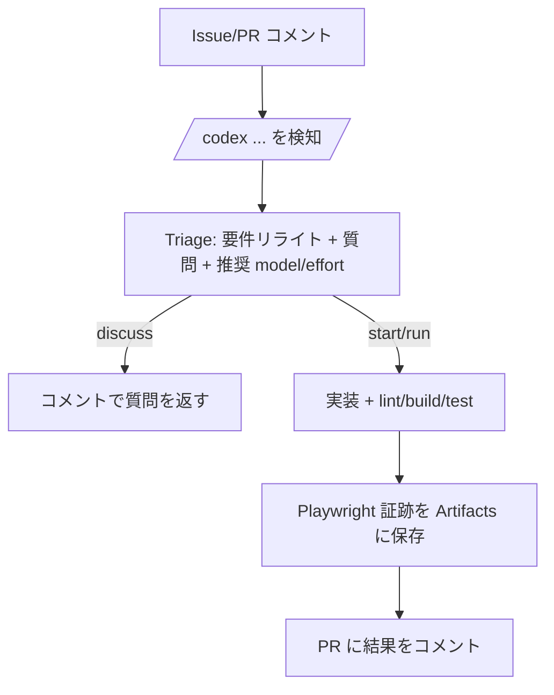

# codex-github-chatops

GitHub の Issue / PR コメントをトリガーに、Codex CLI を CI 上で実行する ChatOps を搭載しています。`/codex` コマンド 1 行で「要件整理（triage）→実装→lint/build/test→Playwright 証跡→PR へ結果返信」まで回します。

関連ドキュメント: `docs/WORKFLOW.md` / `docs/tasklist.md`（プロダクト完遂までのタスクリスト）

## Setup / 外部サービス

ローカル起動手順（PoC / ALB・CloudFront なし）と、必須の AWS サービス（AWS Bedrock / AWS PostgreSQL+pgvector）を接続する手順は `docs/setup.md` を参照してください。

AWS リソース構築手順（PoC 最小: Bedrock + pgvector DB / AWS コンソール中心。ALB/CloudFront なし）は `docs/aws-setup.md` を参照してください。

## できること

このテンプレートが提供する価値の概要です。具体的なコマンド例は下の「使い方」を参照してください。

- コメントだけで開発ループが回る: Issue/PR コメントをトリガーに「要件整理（triage）→実装→lint/build/test→証跡→PR への結果返信」まで自動化
- レビューしやすい成果物が揃う: PR 差分に加えて、Playwright のスクリーンショット/動画/trace を Artifacts として保存
- 失敗に強い: CI 失敗時は最大 5 回まで自動修正ループ（no-diff 時の 1 回強化も含む）
- 同じ PR を育てられる: PR コメントで追加指示して再実行し、同一 PR を更新し続ける運用が可能
- 推論/モデルを制御できる: triage の推奨を使うか、コメントで `--model=...` / `--effort=...` を明示指定

## 使い方（コメントで実行）

コメント本文の「1 行目」に `/codex ...` を置き、2 行目以降に追加指示を書けます。

クイックスタート:

1. Issue を作成し、`/codex start` をコメント
2. 作成/更新された PR の Conversation で結果コメントを確認（Artifacts に証跡あり）
3. 追加指示は PR に `/codex run` をコメント（要件の壁打ちだけしたい場合は `/codex discuss` も可）

### 1) 要件の壁打ち（実装しない）

```text
/codex discuss
要件を整理して、不明点があれば質問して。おすすめの model/effort も教えて。
```

補足: discuss の結果コメントには、推奨モデル/effort を反映した「次に実行すべき `/codex ...` コマンド」も表示されます。

### 2) 実装開始（Issue から）

```text
/codex start --deep
この Issue を実装して。テストも追加して。Playwright の証跡も残して。
```

### 3) 追加指示で再実行（PR 上で）

```text
/codex run
レビュー指摘を反映して。必要なら証跡も更新して。
```

補足: PR の Conversation でも `/codex discuss` を実行できます（実装せず、要件整理と質問のみ）。

## オプション（推論/モデル指定）

以下は `/codex discuss|start|run` の後ろに付けられます。

- `--fast`: `effort=low` 相当
- `--deep`: `effort=high` 相当
- `--xhigh`: `effort=xhigh` 相当
- `--effort=minimal|low|medium|high|xhigh`: effort を明示指定
- `--model=<model_id>`: モデルを明示指定（例: `gpt-5.2-codex`）

補足:

- `--model` / `--effort` は `--model=...` / `--effort=...` の形式で指定します
- 明示指定がある場合はそれを優先し、指定がない場合は triage の推奨値を使います

## ワークフロー概要

このテンプレートは 1 つの ChatOps Workflow（`issue_comment`）で「Issue/PR コメントのどちらでも」動きます。



より詳細（自動修正ループ、no-diff 時の挙動など）は `docs/WORKFLOW.md` を参照してください。

## UI 証跡（Playwright）

- シナリオ定義: `evidence/scenarios.json`
- テスト実装: `tests/e2e/evidence.spec.js`
- 出力先: `test-results/`（スクリーンショット/動画/トレース）, `playwright-report/`

このテンプレートは `tests/e2e/evidence.spec.js` が `evidence/scenarios.json` を読み込み、各 `url` にアクセスして（任意で）`assertText` を確認した上でスクリーンショットを保存します。

### `evidence/scenarios.json` の書き方

- `name`: シナリオ名（テスト名/スクリーンショットのファイル名に使います）
- `url`: 取得したい画面の URL（CI で動くので GitHub Actions の runner から到達できる必要があります）
- `assertText`: 任意。画面に表示されるはずの文字列（`body` に含まれることを確認します。省略すると確認をスキップして撮影だけします）

例:

```json
[
  { "name": "example.com", "url": "https://example.com/", "assertText": "Example Domain" },
  { "name": "example.org", "url": "https://example.org/", "assertText": "Example Domain" }
]
```

実運用では `url`/`assertText` を **自分のアプリ（例: staging 環境）** に合わせて更新してください。ログインが必要・クリックが必要など「到達までに操作が必要」な画面は、`tests/e2e/evidence.spec.js` 側に手順を追加します。

## 実運用で編集することが多いファイル（どこを直す？）

- `evidence/scenarios.json`: 証跡として撮りたい画面（URL）と確認したい文言（`assertText`）を定義
- `tests/e2e/evidence.spec.js`: ログイン/遷移など「証跡取得までの操作」を追加・調整
- `playwright.config.js`: 取得する証跡（trace/video）、タイムアウト、リトライなどを調整
- `.github/workflows/codex-dispatch.yml`: ChatOps の本体。Secret `CODEX_AUTH_JSON`（推奨）または `CODEX_AUTH_JSON_B64` の設定が必要（詳細は `docs/WORKFLOW.md` の「認証（重要）」参照）
- `.github/workflows/pr-ci.yml` / `package.json` / `scripts/build.js`: lint/build/test の中身を自分のリポジトリに合わせて差し替え
