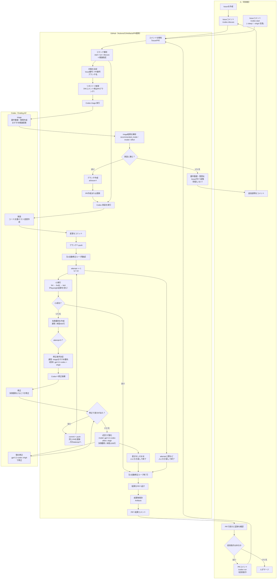

# Workflow 詳細（codex-github-chatops-template）

このドキュメントは、ChatOps ワークフロー `.github/workflows/codex-dispatch.yml` が「何を・どの順番で・どんな成果物を」出すかを、実運用できるレベルまで詳しく説明します。

## 全体像

このテンプレートは Issue/PR コメントで `/codex ...` を検知し、次の流れで動きます。

1. `/codex` コマンド行を解析（mode/flags/追加指示/対象 Issue/PR を特定）
2. （`discuss|start|run` の場合）Codex で triage を実行し、要件リライト + 質問 + 推奨 `model/effort` を JSON で出す
3. triage の結果が `implement` のときだけ実装へ進む（PR がなければ作成）
4. Codex で実装（full-auto）→ lint/build/test → Playwright 証跡 → PR へ結果コメント
5. CI 失敗時は最大 5 回まで自動修正ループ（途中で no-diff の場合は 1 回だけ強化実行）

## Mermaid 図（全体フロー）

補足: README 側には「概要版」の Mermaid 図があります。ここでは「CI の自動修正ループ」まで含めた詳細版を載せます。



## トリガーと入力（コメントの書き方）

- トリガー: `issue_comment` の `created`（新規コメントのみ。編集は対象外）
- 対象: Issue コメント / PR の Conversation コメント
  - PR のレビューコメント（diff 上のコメント）は対象外
- Concurrency: 同一 Issue/PR 番号は `cancel-in-progress`（新しいコメントで前の実行を停止）

### コマンド行のルール

- コメント本文の各行をトリムし、先頭が `/codex` の行を 1 行だけ拾います（最初に見つかったもの）
- それ以外の行（コマンド行以外）は `EXTRA_INSTRUCTIONS` として Codex への追加指示に使われます

例:

```text
/codex start --deep
この Issue を実装して。テストも追加して。証跡も残して。
```

### サブコマンド（mode）

- `discuss`: triage のみ。実装しない
- `start`: triage → 実装（Issue 起点）
- `run`: triage → 実装（PR 起点。追加指示の反映）

補足: `/codex plan` は `discuss` 扱いです（要件整理のみ）。

## オプション（flags）

以下は `/codex <subcommand>` の後ろに付けられます。

- `--model=<model_id>`: Codex 実行時のモデルを明示指定
- `--effort=minimal|low|medium|high|xhigh`: 推論 effort を明示指定
- `--fast`: `effort=low` 相当（簡易）
- `--deep`: `effort=high` 相当（深め）
- `--xhigh`: `effort=xhigh` 相当（最大）

補足:

- `--model` / `--effort` は `--model=...` / `--effort=...` の形式で指定します（例: `--model=gpt-5.2-codex`）
- 優先順位: 明示指定（`--model`/`--effort`/`--fast`/`--deep`/`--xhigh`）→ triage 推奨 → デフォルト

## 対象の特定（Issue/PR どちらで動いているか）

### PR コメントの場合

- `PR_NUMBER`: コメントされた PR 番号
- `BRANCH`: PR の head branch
- `ROOT_ISSUE_NUMBER`: PR 本文から以下のいずれかで推定
  - `Closes #123` / `Fixes #123` / `Resolves #123`
  - もしくは本文中の `#123`

### Issue コメントの場合

- `BRANCH`: `ai/issue-<issue_number>`
- 既に `owner:ai/issue-<issue_number>` を head に持つ open PR があれば、それを再利用します

## Stage A: Triage（要件整理）

対象: `MODE` が `discuss|start|run` のとき。

1. GitHub Script で `.github/codex/triage_prompt.md` を生成
2. `codex exec` を **read-only sandbox** で実行し、`codex-triage.json` を生成
   - スキーマ: `.github/codex/schemas/triage.schema.json`
   - 出力は JSON 固定（CI 側でパースして分岐）
3. `MODE == discuss` または `recommended_mode != implement` の場合、`codex-triage.json` を Issue/PR にコメントとして投稿して終了
4. `recommended_mode == implement` の場合、実装へ進む（`codex-triage.json` は Artifacts に保存され、実装プロンプトにも含まれる）

`codex-triage.json` の主な項目:

- `rewrite`: 要件を書き直した本文（Goals/Non-Goals/Acceptance Criteria を含む想定）
- `assumptions`: 推測した前提
- `questions`: 不明点の質問
- `recommended_mode`: `implement|needs_info|discuss_only`
- `recommended_model` / `recommended_effort`
- `suggested_evidence`: 取るべき証跡シナリオ案

## PR の作成（Issue 起点のみ）

`MODE != discuss` かつ `recommended_mode == implement` で、`PR_NUMBER` が空の場合:

- ブランチ `ai/issue-<n>` を作成/checkout し push
- 既存 PR がなければ PR を作成（あれば再利用）

## Stage B: 実装（Codex full-auto）

triage が `implement` のとき:

- `.github/codex/runtime_prompt.md` を生成（Issue/PR コンテキスト + 追加指示を含む）
- `codex exec --full-auto` を **workspace-write sandbox** で実行
- 生成物（例）:
  - `codex-output.md`（最後のメッセージ要約）
  - 変更差分（コミット対象）

## CI ループ（lint/build/test + 自動修正）

実装後、同一 workflow 内で次を実行します（最大 5 回）。

1. `npm run lint`
2. `npm run build`
3. `npm test`（Playwright 証跡含む）

失敗した場合:

- ログ末尾をまとめた `.github/codex/ci_failure_summary.md` / `ci-logs/*` を作成
- Codex に「失敗要因 + 強制条件（CI を成功させる）」を渡して修正
- 修正差分が出たら commit + push して次の試行へ

### 5 回目の強制条件

- `gpt-5.2-codex` + `effort=xhigh` に固定して最後の修正を試みます。

### no-diff（差分が出ない）時の挙動

Codex 実行後に `git status --porcelain` が空の場合:

- 1 回だけ強化（`gpt-5.2-codex` + `xhigh` + より長いログ）して再実行
- それでも差分が出なければ、そこで止めて人間に引き継ぎます

## 証跡（Artifacts）

この workflow は、次を Artifacts としてアップロードします（CI 画面からダウンロード）。

- `playwright-report/`
- `test-results/`（screenshots/videos/trace）
- `codex-output.md`
- `codex-triage.json`
- `.github/codex/triage_prompt.md`（実行時に生成）
- `.github/codex/runtime_prompt.md`（実行時に生成）
- `.github/codex/ci_failure_summary.md`（失敗時）
- `ci-logs/`（失敗時のログ）

## 認証（重要）

この PoC は、GitHub Secret から `~/.codex/auth.json` を復元して Codex CLI にログインさせます。

- `CODEX_AUTH_JSON`（推奨）: `~/.codex/auth.json` の生 JSON
- `CODEX_AUTH_JSON_B64`: `~/.codex/auth.json` の base64 文字列（互換用）
- これはログインセッション相当のため、漏洩すると第三者に不正利用される可能性があります

### Secret の作り方（例）

- `CODEX_AUTH_JSON`（生 JSON をそのまま登録）
  - GitHub の Secret に `~/.codex/auth.json` の中身を貼り付け
- `CODEX_AUTH_JSON_B64`（base64 を登録）
  - 例（クロスプラットフォーム）:
    ```bash
    python3 - <<'PY'
    import base64, pathlib
    p = pathlib.Path.home() / '.codex' / 'auth.json'
    print(base64.b64encode(p.read_bytes()).decode())
    PY
    ```

## セキュリティ（実運用の推奨）

PoC のままだと「コメントできる人なら誰でも」実行できる構成になりがちです。実運用では以下のいずれか（または組み合わせ）を必ず入れてください。

- 実行者の制限: `github.actor` が organization member / collaborator のみ許可
- `/codex` を受け付けるラベル/チェック（例: `codex:enabled` ラベルが付いている Issue/PR のみ）
- ガード: 変更可能なパスの制限、プロンプト/実装ポリシーの明確化

## カスタマイズのポイント

- Triage 出力スキーマ: `.github/codex/schemas/triage.schema.json`
- Evidence シナリオ: `evidence/scenarios.json` / `tests/e2e/evidence.spec.js`
- CI の内容: `.github/workflows/pr-ci.yml` と `package.json` の scripts
- build の実体: `scripts/build.js`（テンプレートなので実プロジェクトに合わせて差し替え）

## よくある質問 / トラブルシューティング

- 起動しない: 新規コメントで `/codex ...` を送っているか（編集は反応しない）
- triage の内容を見たい: `discuss` / `recommended_mode != implement` の場合はコメントに JSON が出る。実装まで進んだ場合は Artifacts の `codex-triage.json` を参照
- triage で止まる: `codex-triage.json` の `questions` に回答して再度 `/codex start` / `/codex run`
- 証跡が取れない: `evidence/scenarios.json` の URL が CI から到達可能か、`assertText` が実際の表示に一致しているか
