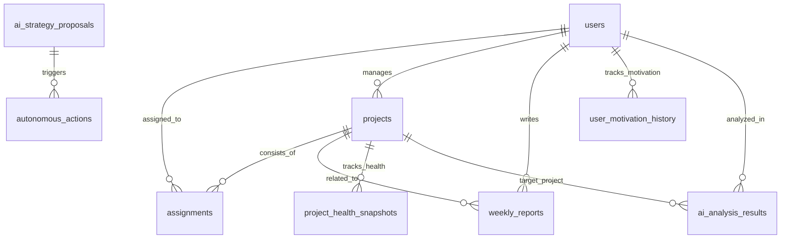

# SaihAI データベース構成仕様（正式）

本ドキュメント（`docs/db-idea.md`）を SaihAI の DB スキーマ仕様（設計書）の **正** とします。

## 前提

- 想定 DB: Amazon Aurora PostgreSQL + pgvector
- Embedding 次元: **1024**（`amazon.titan-embed-text-v2` 想定）
- ローカル開発で SQLite を利用する場合は型マッピングを行う（例: JSONB→TEXT, BYTEA→BLOB, vector(1024)→BLOB, TEXT[]→TEXT）

---

## 1. ER図（エンティティ・リレーションシップ）

主要なテーブル間の関係性です。



---

## 2. テーブル定義（論理設計）

### 2.1 マスタ系（基本データ）

#### users（社員マスタ）

社員の基本情報および AI 分析用のキャリア志向データを保持します。

| カラム名 | データ型 | Key | 説明 | 備考 |
| --- | --- | --- | --- | --- |
| `user_id` | UUID/VARCHAR | PK | 社員の一意識別子 |  |
| `name` | VARCHAR |  | 社員名 |  |
| `role` | VARCHAR |  | 職種 | PM, Dev, Des 等 |
| `skill_level` | INTEGER |  | スキルレベル | 1〜10 |
| `unit_id` | VARCHAR |  | 所属部署/ユニットID |  |
| `cost_per_month` | INTEGER |  | 月単価（予算判定用） | `unit_price` と同義 |
| `can_overtime` | BOOLEAN |  | 残業可否 | PM Agent 参照用 |
| `career_aspiration` | TEXT |  | キャリア志向（テキスト） | 初期の Genome 情報 |
| `career_genome_vector` | Vector(1024) |  | キャリア志向ベクトル | pgvector（1024次元） |

#### projects（プロジェクトマスタ）

プロジェクトの要件、予算、状態を管理します。

| カラム名 | データ型 | Key | 説明 | 備考 |
| --- | --- | --- | --- | --- |
| `project_id` | UUID/VARCHAR | PK | プロジェクトID |  |
| `project_name` | VARCHAR |  | プロジェクト名 |  |
| `manager_id` | UUID | FK | 責任者 | `users.user_id` を参照 |
| `status` | VARCHAR |  | 状態 | 計画中, 稼働中, 炎上中, 完了 |
| `budget_cap` | INTEGER |  | 予算上限（万円） |  |
| `difficulty_level` | VARCHAR |  | 難易度 | L1〜L5 |
| `required_skills` | TEXT[] |  | 必要スキル | 配列形式 |
| `description` | TEXT |  | プロジェクト詳細 |  |

#### assignments（アサイン状況）

誰がどのプロジェクトにどの程度関与しているかを管理します。

| カラム名 | データ型 | Key | 説明 | 備考 |
| --- | --- | --- | --- | --- |
| `assignment_id` | UUID/SERIAL | PK | アサインID |  |
| `user_id` | UUID | FK | 社員ID | `users.user_id` を参照 |
| `project_id` | UUID | FK | プロジェクトID | `projects.project_id` を参照 |
| `role_in_pj` | VARCHAR |  | PJ 内での役割 |  |
| `allocation_rate` | FLOAT |  | 稼働率 | 0.1〜1.0 |
| `start_date` | DATE |  | 開始日 |  |
| `end_date` | DATE |  | 終了日 |  |

---

### 2.2 ログ系（蓄積データ）

#### weekly_reports（週報）

「モチベーション・リスク曲線」の原材料となる定性データと、そのベクトル情報を蓄積します。

| カラム名 | データ型 | Key | 説明 | 備考 |
| --- | --- | --- | --- | --- |
| `report_id` | UUID/SERIAL | PK | 報告ID |  |
| `user_id` | UUID | FK | 社員ID | `users.user_id` を参照 |
| `project_id` | UUID | FK | プロジェクトID | `projects.project_id` を参照 |
| `reporting_date` | DATE |  | 対象週の基準日 |  |
| `content_text` | TEXT |  | 週報本文 | 生データ |
| `content_vector` | Vector(1024) |  | 本文ベクトル | Titan Embedding 等を使用 |
| `reported_at` | TIMESTAMP |  | 作成日時 |  |

---

### 2.3 分析・診断系（AI算出データ）

#### user_motivation_history（モチベーション推移）

AI が算出した個人のモチベーション曲線を保持します。

| カラム名 | データ型 | Key | 説明 | 備考 |
| --- | --- | --- | --- | --- |
| `history_id` | UUID/SERIAL | PK | 履歴ID |  |
| `user_id` | UUID | FK | 社員ID | `users.user_id` を参照 |
| `motivation_score` | FLOAT/INT |  | モチベーションスコア | 0〜100（Y軸） |
| `sentiment_score` | FLOAT |  | ポジネガ分析値 | -1.0〜1.0 |
| `ai_summary` | TEXT |  | AI による要約 |  |
| `recorded_at` | DATE |  | 記録対象日 |  |

#### project_health_snapshots（プロジェクト健全性）

チーム全体のリスクや健全性を時系列で保持します。

| カラム名 | データ型 | Key | 説明 | 備考 |
| --- | --- | --- | --- | --- |
| `snapshot_id` | UUID/SERIAL | PK | スナップショットID |  |
| `project_id` | UUID | FK | プロジェクトID | `projects.project_id` を参照 |
| `health_score` | FLOAT |  | 健全性スコア | 0〜100（Y軸） |
| `risk_level` | VARCHAR |  | リスクレベル | Safe, Warning, Critical |
| `variance_score` | FLOAT |  | メンバー間ベクトル分散 | 認識の乖離度合い |
| `manager_gap_score` | FLOAT |  | 上長・現場間の距離 |  |
| `aggregate_vector` | Vector(1024) |  | チーム重心ベクトル | 傾向分析用 |
| `calculated_at` | TIMESTAMP |  | 計算日時 |  |

#### assignment_patterns（アサイン診断パターン）

「救世主」「燃え尽き」などの診断ラベルマスタです。

| カラム名 | データ型 | Key | 説明 | 備考 |
| --- | --- | --- | --- | --- |
| `pattern_id` | VARCHAR | PK | パターンID | saviour, burnout, etc. |
| `name_ja` | VARCHAR |  | パターン名（日本語） |  |
| `description` | TEXT |  | 説明 |  |

#### ai_analysis_results（個別診断結果）

PM・HR・Risk エージェントによる会議（ディベート）の結果です。

| カラム名 | データ型 | Key | 説明 | 備考 |
| --- | --- | --- | --- | --- |
| `analysis_id` | SERIAL | PK | 診断ID |  |
| `user_id` | VARCHAR | FK | 社員ID | `users.user_id` を参照 |
| `project_id` | VARCHAR | FK | プロジェクトID | `projects.project_id` を参照 |
| `pattern_id` | VARCHAR | FK | 診断パターン | `assignment_patterns.pattern_id` を参照 |
| `debate_log` | JSONB |  | 会議ログ | エージェント間のやり取り |
| `final_decision` | VARCHAR |  | 最終判定 | 採用, 不採用 等 |

---

### 2.4 戦略・自律アクション系（AIエージェント）

#### ai_strategy_proposals（戦略提案プラン）

「軍師」AI が提案する松竹梅のプランです。

| カラム名 | データ型 | Key | 説明 | 備考 |
| --- | --- | --- | --- | --- |
| `proposal_id` | SERIAL | PK | 提案ID |  |
| `project_id` | VARCHAR | FK | プロジェクトID | `projects.project_id` を参照 |
| `plan_type` | VARCHAR |  | プラン種別 | Plan_A, Plan_B, Plan_C |
| `is_recommended` | BOOLEAN |  | 推奨フラグ |  |
| `description` | TEXT |  | 提案内容 | 人事配置の具体案など |
| `predicted_future_impact` | TEXT |  | 未来予測 |  |

#### autonomous_actions（自律アクション・根回し）

Human-in-the-Loop (HITL) を実現するためのアクション管理テーブルです。

| カラム名 | データ型 | Key | 説明 | 備考 |
| --- | --- | --- | --- | --- |
| `action_id` | SERIAL | PK | アクションID |  |
| `proposal_id` | INTEGER | FK | 戦略提案ID | `ai_strategy_proposals.proposal_id` を参照 |
| `action_type` | VARCHAR |  | アクション種別 | mail_draft, meeting_request |
| `draft_content` | TEXT |  | 下書き内容 |  |
| `is_approved` | BOOLEAN |  | 承認ステータス | 人間による承認 |
| `status` | VARCHAR |  | 実行状態 | pending, executed |

#### langgraph_checkpoints（LangGraphステート）

AI エージェントの会話状態（State）を保存し、「時を止めた介入」を可能にします。

| カラム名 | データ型 | Key | 説明 | 備考 |
| --- | --- | --- | --- | --- |
| `thread_id` | VARCHAR | PK | スレッドID | Slack チャンネルID等 |
| `checkpoint` | BYTEA |  | チェックポイント | バイナリ形式の State |
| `metadata` | JSONB |  | メタデータ |  |

---

## 3. 型・実装メモ（物理設計の前提）

### 3.1 ID 型（UUID/VARCHAR）について

- 本仕様上は `UUID/VARCHAR` を許容します（段階移行・PoC 想定）。
- 物理設計で **どちらかに統一**してください（混在させない）。
  - UUID を採用する場合: `uuid` 型 + `gen_random_uuid()` 等を検討
  - VARCHAR を採用する場合: `U001` / `P001` のような短い ID を許容（上限長は要件で決定）

### 3.2 SQLite（ローカル）型マッピング例

| PostgreSQL | SQLite（例） |
| --- | --- |
| `JSONB` | `TEXT` |
| `BYTEA` | `BLOB` |
| `vector(1024)` | `BLOB` |
| `TEXT[]` | `TEXT`（JSON 文字列等） |

---

## 4. DDL（PostgreSQL / pgvector 例）

> 注: `UUID/VARCHAR` は実装方針に合わせて選択します。以下は **ID を VARCHAR とする例**です。

```sql
-- pgvector
CREATE EXTENSION IF NOT EXISTS vector;

-- 1) users
CREATE TABLE users (
  user_id VARCHAR PRIMARY KEY,
  name VARCHAR NOT NULL,
  role VARCHAR,
  skill_level INTEGER CHECK (skill_level BETWEEN 1 AND 10),
  unit_id VARCHAR,
  cost_per_month INTEGER,
  can_overtime BOOLEAN,
  career_aspiration TEXT,
  career_genome_vector vector(1024)
);

-- 2) projects
CREATE TABLE projects (
  project_id VARCHAR PRIMARY KEY,
  project_name VARCHAR NOT NULL,
  manager_id VARCHAR REFERENCES users(user_id),
  status VARCHAR,
  budget_cap INTEGER,
  difficulty_level VARCHAR,
  required_skills TEXT[],
  description TEXT
);

-- 3) assignments
CREATE TABLE assignments (
  assignment_id SERIAL PRIMARY KEY,
  user_id VARCHAR REFERENCES users(user_id),
  project_id VARCHAR REFERENCES projects(project_id),
  role_in_pj VARCHAR,
  allocation_rate DOUBLE PRECISION CHECK (allocation_rate BETWEEN 0.0 AND 1.0),
  start_date DATE,
  end_date DATE
);

-- 4) weekly_reports
CREATE TABLE weekly_reports (
  report_id SERIAL PRIMARY KEY,
  user_id VARCHAR REFERENCES users(user_id),
  project_id VARCHAR REFERENCES projects(project_id),
  reporting_date DATE,
  content_text TEXT,
  content_vector vector(1024),
  reported_at TIMESTAMP
);

-- 5) user_motivation_history
CREATE TABLE user_motivation_history (
  history_id SERIAL PRIMARY KEY,
  user_id VARCHAR REFERENCES users(user_id),
  motivation_score DOUBLE PRECISION CHECK (motivation_score BETWEEN 0.0 AND 100.0),
  sentiment_score DOUBLE PRECISION CHECK (sentiment_score BETWEEN -1.0 AND 1.0),
  ai_summary TEXT,
  recorded_at DATE
);

-- 6) project_health_snapshots
CREATE TABLE project_health_snapshots (
  snapshot_id SERIAL PRIMARY KEY,
  project_id VARCHAR REFERENCES projects(project_id),
  health_score DOUBLE PRECISION CHECK (health_score BETWEEN 0.0 AND 100.0),
  risk_level VARCHAR,
  variance_score DOUBLE PRECISION,
  manager_gap_score DOUBLE PRECISION,
  aggregate_vector vector(1024),
  calculated_at TIMESTAMP
);

-- 7) assignment_patterns
CREATE TABLE assignment_patterns (
  pattern_id VARCHAR PRIMARY KEY,
  name_ja VARCHAR,
  description TEXT
);

-- 8) ai_analysis_results
CREATE TABLE ai_analysis_results (
  analysis_id SERIAL PRIMARY KEY,
  user_id VARCHAR REFERENCES users(user_id),
  project_id VARCHAR REFERENCES projects(project_id),
  pattern_id VARCHAR REFERENCES assignment_patterns(pattern_id),
  debate_log JSONB,
  final_decision VARCHAR
);

-- 9) ai_strategy_proposals
CREATE TABLE ai_strategy_proposals (
  proposal_id SERIAL PRIMARY KEY,
  project_id VARCHAR REFERENCES projects(project_id),
  plan_type VARCHAR,
  is_recommended BOOLEAN,
  description TEXT,
  predicted_future_impact TEXT
);

-- 10) autonomous_actions
CREATE TABLE autonomous_actions (
  action_id SERIAL PRIMARY KEY,
  proposal_id INTEGER REFERENCES ai_strategy_proposals(proposal_id),
  action_type VARCHAR,
  draft_content TEXT,
  is_approved BOOLEAN,
  status VARCHAR
);

-- 11) langgraph_checkpoints
CREATE TABLE langgraph_checkpoints (
  thread_id VARCHAR PRIMARY KEY,
  checkpoint BYTEA,
  metadata JSONB
);

-- 推奨インデックス（例）
CREATE INDEX assignments_user_id_idx ON assignments(user_id);
CREATE INDEX assignments_project_id_idx ON assignments(project_id);
CREATE INDEX weekly_reports_user_id_idx ON weekly_reports(user_id);
CREATE INDEX weekly_reports_project_id_idx ON weekly_reports(project_id);
CREATE INDEX weekly_reports_reporting_date_idx ON weekly_reports(reporting_date);
CREATE INDEX user_motivation_history_user_id_idx ON user_motivation_history(user_id);
CREATE INDEX project_health_snapshots_project_id_idx ON project_health_snapshots(project_id);
CREATE INDEX ai_analysis_results_user_id_idx ON ai_analysis_results(user_id);
CREATE INDEX ai_analysis_results_project_id_idx ON ai_analysis_results(project_id);
CREATE INDEX ai_strategy_proposals_project_id_idx ON ai_strategy_proposals(project_id);
CREATE INDEX autonomous_actions_proposal_id_idx ON autonomous_actions(proposal_id);
```

---

## 5. 技術的特記事項

- **pgvector の利用**: `users.career_genome_vector` や `weekly_reports.content_vector` などで 1024 次元のベクトルを保持し、セマンティック検索やマッチングを行います。
- **モチベーション・リスク曲線**: `user_motivation_history` と `project_health_snapshots` を結合し、ダッシュボード上で可視化します。
- **HITL (Human-in-the-Loop)**: `autonomous_actions` と `langgraph_checkpoints` を組み合わせ、承認待ちで処理を停止/再開できる永続化を実現します。

