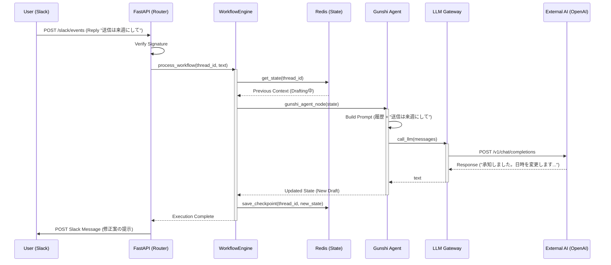

# SaihAI v2.0 バックエンド詳細機能設計書（FastAPI + LangGraph）

| 項目 | 値 |
| --- | --- |
| 対象 | FastAPI + LangGraph |
| 範囲 | 「リクエスト受信」→「ワークフロー起動/再開」→「外部AI（LLM）実行」 |
| 主UI連携 | Slack Events API / Interactivity |
| ステート管理 | Redis（LangGraph checkpointer / 一時状態）+ Aurora（履歴・監査） |

関連: `docs/saihai-v2-system-requirements.md`

## 1. モジュール構成図（Directory Structure）

### 1.1 目標構成（設計案）

```text
src/
 app/
    main.py                # アプリケーションエントリーポイント
    routers/
       slack.py           # Slack Event API用エンドポイント
       dashboard.py       # Webダッシュボード用REST API
    services/
       workflow_engine.py # LangGraphグラフ構築実行制御
       state_manager.py   # RedisへのState永続化制御
    agents/                # 各エージェントのロジック
       watchdog.py        # 監視トリガー
       gunshi.py          # 戦略立案 (軍師)
       drafter.py         # 文面作成
    core/
        llm_gateway.py     # 外部AIへの接続アダプター
        config.py          # 環境変数設定
 models/
     schemas.py             # Pydanticデータモデル

```

### 1.2 実装マッピング（このリポジトリの例）

本リポジトリでは `backend/app/` 配下に API / ドメイン / 統合が配置される想定（または現状の配置）とし、上記の「設計案」は概念上のレイヤ分割として扱う。

## 2. Layer 1: コントローラー層（Interface Layer）

外部（Slack/Frontend）からの HTTP リクエストを受け付け、データ検証後にサービス層へ処理を委譲する。

### 2.1 Slack Event Handler（`routers/slack.py` 相当）

Slack からの Webhook イベント（メンションやボタン押下）を受信する。

#### 関数: `handle_slack_events`

- **役割:** Slack Events API からの POST リクエストのエントリーポイント。認証とイベントの振り分けを行う。
- **Args:**
  - `request: Request`（FastAPI Request object）
  - `background_tasks: BackgroundTasks`（非同期実行用）
- **Returns:** `JSONResponse`（Slack には即座に 200 OK を返し、処理は非同期で行う）
- **Logic:**
  1. `verify_slack_signature(request)` で改ざん検証。
  2. イベントタイプ判定（`app_mention`, `block_actions` 等）。
  3. `background_tasks.add_task(process_workflow, event_data)` でサービス層を非同期呼び出し。

### 2.2 Workflow Trigger（`routers/slack.py` or internal helper）

#### 関数: `process_workflow`

- **役割:** 非同期タスクとして実行され、LangGraph ワークフローを起動する。
- **Args:**
  - `event_data: Dict`（Slack イベントのペイロード）
- **Returns:** `None`
- **Logic:**
  1. `thread_id`（Slack のスレッド TS または ユーザーID）を抽出。
  2. `WorkflowEngine.invoke_graph(thread_id, user_input)` を呼び出す。

## 3. Layer 2: サービスオーケストレーション層（Service Layer）

LangGraph を用いてエージェント間の連携と状態管理（State Management）を行う。

### 3.1 Workflow Engine（`services/workflow_engine.py`）

グラフの定義と実行を担う中核クラス。

#### 関数: `build_graph`

- **役割:** エージェント（Node）と遷移条件（Edge）を定義し、コンパイルされたグラフオブジェクトを返す。
- **Args:** `None`
- **Returns:** `CompiledGraph`
- **Logic:**

```python
workflow = StateGraph(AgentState)
workflow.add_node("monitor", monitor_agent)
workflow.add_node("gunshi", gunshi_agent)
workflow.add_node("human_review", human_node)  # 介入用ノード

workflow.set_entry_point("monitor")
workflow.add_edge("monitor", "gunshi")
# 条件付きエッジ: 承認なら実行、介入なら修正へ
workflow.add_conditional_edges("human_review", should_continue)

return workflow.compile(checkpointer=RedisSaver)
```

#### 関数: `invoke_graph`

- **役割:** 特定の `thread_id` の文脈（メモリ）をロードし、グラフを実行する。
- **Args:**
  - `thread_id: str`（セッションID）
  - `input_data: str`（ユーザーのメッセージや観測データ）
- **Returns:** `Dict`（最終的なエージェントの状態）
- **Logic:**
  1. `config = {"configurable": {"thread_id": thread_id}}` を設定。
  2. `graph.invoke({"messages": [input_data]}, config)` を実行。
  3. 実行結果に基づき、Slack への通知関数を呼び出す。

## 4. Layer 3: エージェントロジック層（Agent Layer）

個々のエージェントの思考プロセスを定義する。

### 4.1 Gunshi Agent（`agents/gunshi.py`）

状況を分析し、次のアクションプランを決定する。

#### 関数: `gunshi_agent_node`

- **役割:** LangGraph のノードとして機能。プロンプトを構築し、LLM ゲートウェイを呼び出す。
- **Args:**
  - `state: AgentState`（現在の会話履歴やコンテキスト）
- **Returns:** `Dict`（更新された State）
- **Logic:**
  1. `state` から過去の履歴と最新の観測データ（Monitor の出力）を取得。
  2. システムプロンプト（「あなたは軍師です...」）を構築。
  3. `LLMGateway.call_llm(messages)` を実行。
  4. LLM のレスポンス（プラン内容）を `state["messages"]` に追加して返す。

## 5. Layer 4: コア外部接続層（Core Layer）

外部 AI サービス（OpenAI API / AWS Bedrock）への接続を抽象化する。

### 5.1 LLM Gateway（`core/llm_gateway.py`）

API キーの管理、リトライ処理、ログ出力を一元管理する。

#### 関数: `call_llm`

- **役割:** 外部 AI サービスへリクエストを送信し、テキスト生成結果を取得する。
- **Args:**
  - `messages: List[Dict]`（OpenAI 形式のメッセージリスト `[{role: "user", content: "..."}]`）
  - `model: str`（デフォルト: `"gpt-4-turbo"` または `"anthropic.claude-v2"`）
  - `temperature: float`（創造性の制御）
- **Returns:** `str`（生成されたテキスト）
- **Logic:**
  1. **Retry Policy:** `tenacity` 等で API 一時エラー時の再試行（Wait 2s -> 4s -> 8s）。
  2. **API Call:**

```python
# OpenAIの場合
response = client.chat.completions.create(
    model=model,
    messages=messages,
    temperature=temperature,
)
```

  3. **Logging:** 入出力トークン数とレイテンシをログ記録（コスト管理用）。
  4. **Extract:** `response.choices[0].message.content` を返却。

## 6. シーケンスフロー（実行の流れ）

ユーザーが Slack で「プランを修正して」と介入（Reply）した場合のフロー。



## 7. 次のステップ

この機能設計に基づき、次を選択して掘り下げる。

- **主要なクラス（WorkflowEngine や LLMGateway）の具体的な Python コードの実装**
- **データベース（Aurora/Redis）のテーブル定義詳細の作成**

