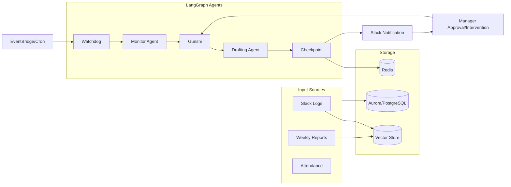

# SaihAI v2.0 システム設計・機能要件定義書

| 項目 | 値 |
| --- | --- |
| 名称 | SaihAI v2.0 (Auto-Pilot System) |
| コアバリュー | 「99%の自律と1%の直感」 |
| 主目的 | 調整根回し（Shadow Loop）の自動化により、マネージャーが意思決定（Approval）へ集中できる状態をつくる |
| 主なUI | Slack（通知 + 1クリック承認/介入） / Angular SPA（ダッシュボード） |

## 0. このドキュメントの目的と範囲

- 目的: SaihAI v2.0 の「何を作るか（要件）」と「どう動くか（基本〜詳細設計）」を、開発チームで共有可能な粒度に整理する。
- 範囲: 監視（24/7）→ 異常検知 → 立案（プランA/B）→ 下書き生成 → Slack通知（承認/介入/却下）→ 実行 → 履歴閲覧（Dashboard）まで。
- 本書は「企画書およびアーキテクチャ図」に基づく。数値SLAなど未確定項目は **TBD** として明示する。

## 1. プロダクト概要（Requirements Definition）

### 1.1 プロダクトコンセプト

- **名称:** SaihAI v2.0 (Auto-Pilot System)
- **コアバリュー:** 「99%の自律と1%の直感」
  - マネージャーの業務を奪うのではなく、調整根回し（Shadow Loop）を自動化する。
  - 人は意思決定（Approval）と例外対応（Intervention）に集中する。

### 1.2 アクター（Actors）

1. **Manager（ユーザー）:** 決裁者。通知を受け取り、承認または介入を行う。
2. **Employees（監視対象）:** 週報やSlackログの解析対象となる部下。
3. **External Stakeholders:** クライアントや人事部など、自動生成された連絡の受信者。

## 2. 機能要件（Functional Requirements）

### 2.1 機能一覧（企画ベース）

| カテゴリ | 機能名 | 要件詳細 |
| --- | --- | --- |
| 監視 | 24/7 Shadow Monitoring | 週報、勤怠、Slack発言を常時監視し、異常値（離職リスク、モチベーション低下）を検知する。 |
| 立案 | Autonomous Nemawashi | 検知した課題に対し、解決策（プランA/B）を立案し、必要なドキュメント（メール、稟議書）を下書きする。 |
| UI/UX | Slack Notification | 提案内容をSlackに通知する。「承認」「介入」のアクションボタンを表示する。 |
| 介入 | Human-in-the-loop | ユーザーの自然言語によるフィードバック（介入）を受け付け、実行直前でプランを再計算修正する。 |
| 実行 | Action Execution | 承認されたアクション（メール送信、カレンダー予約、APIコール）を自動実行する。 |
| 履歴 | Dashboard | 詳細な分析ログや過去の対応履歴をWeb画面で閲覧可能にする。 |

### 2.2 機能要件（仕様化 / ID付与）

- **FR-001 監視データ収集**
  - 入力: 週報テキスト、勤怠ログ、Slackログ（投稿数/文面/反応速度など）
  - 動作: 定期的に収集し、構造化データ（RDB）と非構造化データ（Vector Store）へ格納する。
- **FR-002 異常検知（Watchdog/Monitor）**
  - 動作: 全社員のスコアを簡易スキャンし、異常候補を抽出する（Watchdog）。
  - 動作: 候補について詳細分析し、意味解釈（例: 「飽きた」発言）を行い、リスク判定（High/Med/Low）を確定する（Monitor Agent）。
- **FR-003 自律根回し（Gunshi/Drafting）**
  - 動作: リスク判定と人事/プロジェクト情報に基づき、解決策（プランA/B）を立案する（Gunshi）。
  - 動作: 必要ドキュメント（クライアント向けメール、社内人事向け申請書等）を下書き生成する（Drafting Agent）。
- **FR-004 Slack通知（承認/介入/却下）**
  - 動作: 生成結果をSlackに通知し、プレビュー（メール下書き、人事申請書案など）を添付する。
  - UI: `[承認(Execute)]` `[介入(Chat)]` `[却下]` を提示する。
- **FR-005 介入（Human-in-the-loop / Re-planning）**
  - 入力: Slackスレッド返信などの自然言語フィードバック
  - 動作: `thread_id` をキーに状態を復元し、コンテキストを維持したままプランとドラフトを再計算・修正する（Gunshi - Re-planning → Drafting）。
  - 出力: 修正案をSlackへ即時再提示し、再度ワンクリック承認を可能にする。
- **FR-006 実行（Action Executor）**
  - 動作: 承認されたアクションを自動実行する（メール送信/送信予約、カレンダー予約、外部APIコール）。
  - 完了通知: Slackに実行結果を返す。
- **FR-007 ダッシュボード（Angular SPA）**
  - 動作: 分析ログ・対応履歴（いつ/誰に/何を提案し/どう修正され/何を実行したか）を閲覧できる。

### 2.3 使い方（Manager / 操作ガイド）

- **Slack通知を受け取る:** リスク概要・推奨プラン・ドラフト（メール/申請書）のプレビューを確認する。
- **`[承認(Execute)]`:** 提案どおりに実行を進める（メール送信/送信予約、カレンダー予約、外部APIコール）。
- **`[介入(Chat)]` / スレッド返信:** 自然言語で修正指示を返し、AI が再計算した修正案を受け取った上で再承認する。
- **`[却下]`:** 実行せずに終了し、履歴（Dashboard）から追跡可能にする。
- **Dashboard:** 分析ログ・対応履歴を閲覧し、過去の提案/介入/実行結果を追跡する。

## 3. 非機能要件（Non-Functional Requirements）

- **NFR-001 可用性:** マネージャーがオフラインでも監視を継続する（Watchdog Trigger / Cron）。
- **NFR-002 データ整合性:** 介入による中断再開時にコンテキスト（会話履歴）を保持する（Persistence / Redis）。
- **NFR-003 レスポンス:** 介入指示から再計算までは即座に行う（目標: 数秒、SLOはTBD）。

補足（設計上の必須観点 / 詳細は別途TBD）:

- **セキュリティ:** Slack署名検証、API認証、機密情報の秘匿、監査ログ。
- **可観測性:** LLM入出力・トークン・レイテンシ、ワークフロー状態遷移、実行結果を追跡できるログ設計。

## 4. 基本設計（Basic Design）

### 4.1 システムアーキテクチャ

AWS Fargate を中心としたコンテナ構成と、LangGraph によるステートフルなエージェント制御を採用する。

- **Frontend**
  - **Slack Interface:** 通知・簡易操作（メインUI）
  - **Angular SPA（S3 + CloudFront）:** 詳細ダッシュボード
- **Backend**
  - **API Gateway:** FastAPI (Python) on Amazon ECS
  - **Orchestrator:** LangGraph を用いたエージェント制御
- **Database**
  - **Amazon Aurora（PostgreSQL）:** 構造化データ（社員情報、ログ）
  - **Amazon ElastiCache（Redis）:** 会話ステート、一時保存データ
  - **Vector Store（pgvector/Pinecone）:** 非構造化データ（週報のニュアンス等）の埋め込み

### 4.2 データフロー（Data Flow）

1. **Input:** Slack/週報データを定期 fetch → Vector DB へ格納
2. **Trigger:** EventBridge が定期的に Watchdog を起動 → 異常検知開始
3. **Process:** LangGraph エージェントが推論生成 → Redis に状態保存して「一時停止」
4. **Output:** Slack へ通知 → ユーザーアクション待機

## 5. 詳細設計（Detailed Design）

### 5.1 エージェント構成（LangGraph Nodes）

| エージェント名 | 役割ロジック | 入力データ | 出力データ |
| --- | --- | --- | --- |
| Watchdog | 定期実行トリガー。全社員のスコアを簡易スキャン。 | 勤怠ログ、Slack投稿数 | 異常スコアリスト |
| Monitor Agent | 詳細分析。異常値の意味（「飽きた」発言など）を解釈。 | 週報テキスト、Slack履歴 | リスク判定 (High/Med/Low) |
| Gunshi（軍師） | 戦略立案。リスクに対する解決策（プランA/B）を決定。 | リスク判定、人事データ | アクションプラン指示書 |
| Drafting Agent | 実行データの生成。メール文面や申請書の作成。 | アクションプラン | メール下書き、JSONペイロード |
| Checkpoint | **重要:** プロセスを中断し、人間の承認を待つ。 | 生成された全ドラフト | (Slack通知イベント) |

### 5.2 データベース論理設計（主要テーブル）

- **Employees（Aurora）**
  - 主要項目: `employee_id`, `name`, `department`, `risk_score`
- **Intervention_Logs（Redis/Aurora）**
  - 主要項目: `thread_id`（LangGraph 用）, `current_state`（承認待ち/修正中）, `draft_content`（メール本文等）
- **Vector_Embeddings（Vector Store）**
  - 主要項目: `content_vector`（週報の中身）, `metadata`（日付, 感情ラベル）

### 5.3 API設計（External AI Requests）

#### A. 異常検知リスク分析（Monitor Agent）

- **Trigger:** Watchdog からのアラート時
- **Prompt（System）:**
  > あなたは優秀な人事リスク分析官です。以下の週報とSlackログから、離職兆候やメンタル不調のサインを検知し、リスクレベル(0-100)と理由を出力してください。
- **Input:** `user_text_history`（直近2週間のテキストデータ）
- **Output（JSON）:** `{ "risk_level": 85, "reason": "プロジェクトへの飽きと言及あり", "urgency": "High" }`

#### B. 根回しドキュメント生成（Drafting Agent）

- **Trigger:** Gunshi によるプラン決定時
- **Prompt（System）:**
  > あなたは熟練のマネージャー補佐です。以下の状況に基づき、クライアントへの担当変更メールと、社内人事への異動申請書を下書きしてください。
- **Input:** `target_employee`, `client_info`, `plan_details`（例: プランB: 若手抜擢＋技術顧問化）
- **Output（JSON）:** `{ "email_draft": "件名:...", "approval_doc": "..." }`

#### C. 介入時の再計算（Gunshi - Re-planning）

- **Trigger:** ユーザーからの修正指示（Slack Reply）
- **Prompt（System）:**
  > ユーザーから以下の修正指示がありました。コンテキストを維持しつつ、プランとドラフトを修正してください。
- **Input:** `previous_draft`, `user_feedback`（例: "メール送信は来週月曜にして"）
- **Output:** `{ "action": "reschedule", "new_draft": "...", "scheduled_time": "202X-XX-XX" }`

## 6. ユーザー操作手順とシステム挙動（User Scenario Flow）

シナリオ: 部下の「燃え尽き」検知と介入

### Step 1: 予知と準備（System Only）

1. **検知:** Watchdog が深夜 2:00 に田中氏の週報から「飽きた」というキーワードと返信速度低下を検知。
2. **立案:** Gunshi が「プランB（技術顧問化）」を策定し、Drafting Agent がクライアント向けメールを下書き。
3. **待機:** Checkpoint で処理を停止し、朝 9:00 に Slack 通知を予約。

### Step 2: 通知と確認（Manager Action）

1. **通知:** マネージャーの Slack に通知が届く。
   - **Message:** 「🚨 緊急提案: プロジェクトフェニックスの田中氏に『燃え尽き兆候』あり。」
   - **Attachment:** メール下書きプレビュー、人事申請書案
   - **Buttons:** `[承認(Execute)]` `[介入(Chat)]` `[却下]`

### Step 3: 介入（Intervention）

1. **操作:** マネージャーがスレッドで返信（介入）する。
   - **Input:** 「プランはOK。ただしクライアントへのメール送信だけ来週月曜にして。（担当者が休暇中のため）」
2. **システム挙動:**
   - API Gateway が Webhook を受信し、Redis から `thread_id` を取得して LangGraph の状態を復元（Resume）。
   - Gunshi が指示を解釈し、Drafting Agent に送信予約日時の書き換えを命令。

### Step 4: 再提示と承認（One-Click Decision）

1. **再通知:** AI が修正案を即座に Slack へ返す。
   - **AI:** 「承知しました。メール送信予約を来週月曜に変更しました。他は直ちに実行します。」
2. **操作:** マネージャーが `[実行(Execute)]` ボタンをクリック。

### Step 5: 実行（Execution）

1. **処理:** Action Executor が以下を実行。
   - 人事システムへ異動申請 API を POST
   - Gmail API 経由でクライアント宛メールを送信予約（来週月曜指定）
   - 田中氏のカレンダーに「ケア面談」を仮押さえ
2. **完了:** Slack に「全タスクの根回しが完了しました」と表示。

## 7. 次のステップ（設計→実装への移行）

開発フェーズへ移行するため、次を選択して作業を開始する。

- **AWS環境（CDK/Terraform）のインフラコード生成**
- **LangGraphの詳細なステート定義（Pythonコード）の作成**
