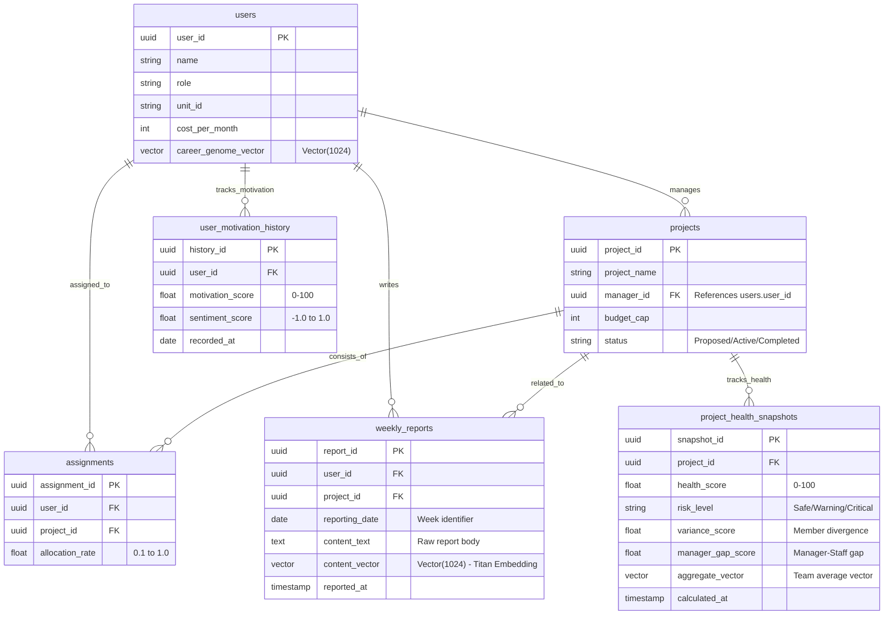

# データベース構成仕様

*出典: 「テーブル構成図.docx」*

# SaihAI データベース設計（テーブル定義書）

## Saihaiテーブル定義

---

## 1. マスタ系（基本データ）

組織の構造とリソースを定義します。

### users

| カラム名 | データ型 | キー | 説明 | 備考（スプレッドシート用） |
| --- | --- | --- | --- | --- |
| user_id | UUID | PK | 社員の一意識別子 |  |
| name | VARCHAR |  | 社員名 |  |
| role | VARCHAR |  | 職種 (PM, Dev, Des等) |  |
| unit_id | VARCHAR |  | 所属部署/ユニットID |  |
| cost_per_month | INTEGER |  | 月単価（予算判定用） |  |
| career_genome_vector | Vector(1024) |  | キャリア志向・価値観のベクトル | AI分析の基礎データ |

### projects

| カラム名 | データ型 | キー | 説明 | 備考（スプレッドシート用） |
| --- | --- | --- | --- | --- |
| project_id | UUID | PK | プロジェクトの一意識別子 |  |
| project_name | VARCHAR |  | プロジェクト名 |  |
| manager_id | UUID | FK | 責任者（users.user_id） |  |
| budget_cap | INTEGER |  | 予算上限 |  |
| status | VARCHAR |  | 状態 (Proposed, Active, Completed) |  |

### assignments

| カラム名 | データ型 | キー | 説明 | 備考（スプレッドシート用） |
| --- | --- | --- | --- | --- |
| assignment_id | UUID | PK | アサインID |  |
| user_id | UUID | FK | 社員ID |  |
| project_id | UUID | FK | プロジェクトID |  |
| allocation_rate | FLOAT |  | 稼働率 (0.1 〜 1.0) |  |

---

## 2. ログ系（蓄積データ）

日々の活動や週報を蓄積します。ここが「モチベーション・リスク曲線」の原材料になります。

### weekly_reports

| カラム名 | データ型 | キー | 説明 | 備考（スプレッドシート用） |
| --- | --- | --- | --- | --- |
| report_id | UUID | PK | 報告ID |  |
| user_id | UUID | FK | 社員ID |  |
| project_id | UUID | FK | プロジェクトID |  |
| reporting_date | DATE |  | 対象週の基準日 | 週次集計の起点 |
| content_text | TEXT |  | 週報の本文（生データ） |  |
| content_vector | Vector(1024) |  | 本文のベクトル（Titan Embedding） | AI分析用インプット |
| reported_at | TIMESTAMP |  | データ作成日時 |  |

---

## 3. 分析系（可視化データ）

AIが計算した結果を保存します。ダッシュボードのグラフはこのテーブルを参照します。

### user_motivation_history

| カラム名 | データ型 | キー | 説明 | 備考（スプレッドシート用） |
| --- | --- | --- | --- | --- |
| history_id | UUID | PK | 履歴ID |  |
| user_id | UUID | FK | 社員ID |  |
| motivation_score | FLOAT |  | 0-100（モチベーション曲線用） | モチベーション曲線のY軸 |
| sentiment_score | FLOAT |  | ポジネガ分析値 |  |
| recorded_at | DATE |  | 記録対象日（週単位） | モチベーション曲線のX軸 |

### project_health_snapshots

| カラム名 | データ型 | キー | 説明 | 備考（スプレッドシート用） |
| --- | --- | --- | --- | --- |
| snapshot_id | UUID | PK | スナップショットID |  |
| project_id | UUID | FK | プロジェクトID |  |
| health_score | FLOAT |  | 0-100（リスク曲線用） | プロジェクトリスク曲線のY軸 |
| risk_level | VARCHAR |  | 警告レベル (Safe, Warning, Critical) |  |
| variance_score | FLOAT |  | メンバー間のベクトル分散（認識の乖離） | 「ボトムアップ検知」の主要ロジック |
| manager_gap_score | FLOAT |  | マネージャーと現場のベクトル距離 |  |
| aggregate_vector | Vector(1024) |  | チーム全体の重心ベクトル（傾向分析用） |  |
| calculated_at | TIMESTAMP |  | 計算実行日時 | プロジェクトリスク曲線のX軸 |

---

## ER図マーメイド記法



---

## DDL

```sql
-- pgvector拡張の有効化（Genome解析用）
CREATE EXTENSION IF NOT EXISTS vector;

-- 1. 社員マスタ
CREATE TABLE users (
    user_id VARCHAR(10) PRIMARY KEY,
    name VARCHAR(50) NOT NULL,
    role VARCHAR(50),
    skill_level INTEGER CHECK (skill_level BETWEEN 1 AND 10), -- 1:ジュニア, 10:エキスパート
    unit_price INTEGER, -- 万円/月
    can_overtime BOOLEAN DEFAULT TRUE, -- 残業可否（PM Agentが参照）
    career_aspiration TEXT, -- キャリア志向（初期のGenome情報）
    created_at TIMESTAMP DEFAULT CURRENT_TIMESTAMP
);

-- 2. プロジェクトマスタ
CREATE TABLE projects (
    project_id VARCHAR(10) PRIMARY KEY,
    name VARCHAR(100) NOT NULL,
    status VARCHAR(20), -- 計画中, 稼働中, 炎上中, 完了
    budget_cap INTEGER, -- 許容単価上限（万円）
    difficulty_level VARCHAR(2), -- L1〜L5
    required_skills TEXT[], -- 必要スキルの配列
    description TEXT
);

-- 3. アサイン状況
CREATE TABLE assignments (
    assignment_id SERIAL PRIMARY KEY,
    project_id VARCHAR(10) REFERENCES projects(project_id),
    user_id VARCHAR(10) REFERENCES users(user_id),
    role_in_pj VARCHAR(50),
    start_date DATE,
    end_date DATE,
    remarks TEXT
);

-- 4. 週報（Genomeデータの源泉）
CREATE TABLE weekly_reports (
    report_id SERIAL PRIMARY KEY,
    user_id VARCHAR(10) REFERENCES users(user_id),
    posted_at TIMESTAMP NOT NULL,
    content TEXT NOT NULL,
    -- pgvectorによるベクトル変換データ（1024次元はamazon.titan-v2等を想定）
    content_embedding vector(1024)
);

-- 5. アサイン診断パターン・マスタ（6つのラベル）
CREATE TABLE assignment_patterns (
    pattern_id VARCHAR(20) PRIMARY KEY, -- saviour, burnout, rising_star, etc.
    name_ja VARCHAR(50),
    description TEXT
);

-- 6. 個別診断結果（Agent会議の結果）
CREATE TABLE ai_analysis_results (
    analysis_id SERIAL PRIMARY KEY,
    user_id VARCHAR(10) REFERENCES users(user_id),
    project_id VARCHAR(10) REFERENCES projects(project_id),
    pattern_id VARCHAR(20) REFERENCES assignment_patterns(pattern_id),
    pm_risk_score INTEGER, -- 0-100
    hr_risk_score INTEGER, -- 0-100
    risk_risk_score INTEGER, -- 0-100
    debate_log JSONB, -- エージェント同士のやり取りの生ログ
    final_decision VARCHAR(20), -- 採用, 不採用, 条件付採用
    analyzed_at TIMESTAMP DEFAULT CURRENT_TIMESTAMP
);

-- 7. 戦略提案プラン（松竹梅 3プラン）
CREATE TABLE ai_strategy_proposals (
    proposal_id SERIAL PRIMARY KEY,
    project_id VARCHAR(10) REFERENCES projects(project_id),
    plan_type VARCHAR(10), -- Plan_A, Plan_B, Plan_C
    is_recommended BOOLEAN DEFAULT FALSE,
    recommendation_score INTEGER,
    description TEXT, -- 「佐藤をリーダー、田中を技術顧問とする」等
    total_cost INTEGER,
    predicted_future_impact TEXT,
    created_at TIMESTAMP DEFAULT CURRENT_TIMESTAMP
);

-- 8. 自律アクション・根回し（HITL用）
CREATE TABLE autonomous_actions (
    action_id SERIAL PRIMARY KEY,
    proposal_id INTEGER REFERENCES ai_strategy_proposals(proposal_id),
    action_type VARCHAR(50), -- mail_draft, meeting_request, etc.
    draft_content TEXT,
    is_approved BOOLEAN DEFAULT FALSE,
    approved_at TIMESTAMP,
    scheduled_at TIMESTAMP, -- 「来週月曜に送信」などの予約用
    status VARCHAR(20) DEFAULT 'pending' -- pending, executed, cancelled
);

-- 9. モチベーション推移履歴（ダッシュボード・グラフ用）
CREATE TABLE user_motivation_history (
    history_id SERIAL PRIMARY KEY,
    user_id VARCHAR(10) REFERENCES users(user_id),
    measured_date DATE,
    score INTEGER,
    ai_summary TEXT
);

-- 10. プロジェクト健全性履歴（ダッシュボード・グラフ用）
CREATE TABLE project_health_snapshots (
    snapshot_id SERIAL PRIMARY KEY,
    project_id VARCHAR(10) REFERENCES projects(project_id),
    measured_date DATE,
    budget_usage_rate INTEGER,
    delay_risk_rate INTEGER,
    overall_health VARCHAR(20)
);

-- 11. LangGraph ステート管理（KVSの代替）
CREATE TABLE langgraph_checkpoints (
    thread_id VARCHAR(100) PRIMARY KEY,
    checkpoint BYTEA NOT NULL, -- バイナリ形式でStateを保存
    metadata JSONB,
    updated_at TIMESTAMP DEFAULT CURRENT_TIMESTAMP
);
```

---

## サンプルデータ

## 2. 📊 サンプルデータ

### ① users & projects (コアデータ)

```sql
INSERT INTO users (user_id, name, role, skill_level, unit_price, can_overtime, career_aspiration) VALUES
('U001', '渡辺 救', 'テックリード', 9, 90, TRUE, '高難度案件の解決'),
('U002', '田中 未来', 'シニア開発', 10, 95, FALSE, '若手育成へのシフト'),
('U003', '佐藤 健太', 'ジュニア開発', 3, 60, TRUE, '早期のリーダー経験');

INSERT INTO projects VALUES
('P001', 'プロジェクト・フェニックス', '炎上中', 100, 'L5', '{"Java", "Spring", "Oracle"}', '納期直前のデスマーチ状態');
```

### ② assignment_patterns (診断ラベル)

```sql
INSERT INTO assignment_patterns VALUES
('the_savior', '全会一致', '能力・意欲・条件が全て合致した即戦力'),
('burnout', '燃え尽き', '能力はあるが、メンタル面での離職リスクが極めて高い'),
('rising_star', 'ダイヤの原石', '現状のスキルは不足しているが、成長意欲が高く将来有望'),
('luxury', '高嶺の花', '能力は完璧だが、予算上限を大幅に超過している'),
('toxic', '隠れ爆弾', 'スキルは高いが、チームワークに致命的な懸念がある'),
('constraint', '制約あり', '稼働時間などの条件がプロジェクトの要求と不一致');
```

### ③ ai_analysis_results (エージェント会議の結果)

```sql
-- 田中未来（U002）の診断例
INSERT INTO ai_analysis_results (user_id, project_id, pattern_id, pm_risk_score, hr_risk_score, risk_risk_score, debate_log, final_decision)
VALUES (
    'U002', 'P001', 'burnout', 20, 95, 90,
    '{"PM": "即戦力として最高", "HR": "週報に腰痛・飽きの記述あり。燃え尽き寸前", "Risk": "離職による崩壊リスク極大"}',
    '不採用'
);
```

### ④ ai_strategy_proposals (軍師の3つの采配)

```sql
-- プロジェクト・フェニックスへの提案
INSERT INTO ai_strategy_proposals (project_id, plan_type, is_recommended, recommendation_score, description) VALUES
('P001', 'Plan_A', FALSE, 40, '田中を投入し短期解決（高リスク）'),
('P001', 'Plan_B', TRUE, 85, '佐藤リーダー＋田中技術顧問（未来投資）'),
('P001', 'Plan_C', FALSE, 60, '外部フリーランスのスポット投入（コスト重視）');
```

### ⑤ weekly_reports (定性データの蓄積)

```sql
-- 田中さんの「匂わせ」週報
INSERT INTO weekly_reports (user_id, posted_at, content)
 VALUES ('U002', '2025-12-15 18:00:00', '最近、腰痛がひどい。同じ作業の繰り返しで、このままで良いのか不安。');
-- ※実装時はここに vector(1024) の embedding データが追加されます。
```

---

## 💡 メンバーへの申し送り事項

- **pgvector:** weekly_reports の content_embedding カラムを使って、**「モチベーションの機微」**をセマンティック検索します。
- **HITL:** langgraph_checkpoints に thread_id（例：SlackのチャンネルIDやスレッドタイムスタンプ）をキーとして保存し、**「時を止めた介入」**を実現します。
- **初期表示:** project_health_snapshots と ai_analysis_results を結合することで、ダッシュボード上に**「なぜこのプロジェクトに誰が必要か」**という根拠をリアルタイムに表示します。
