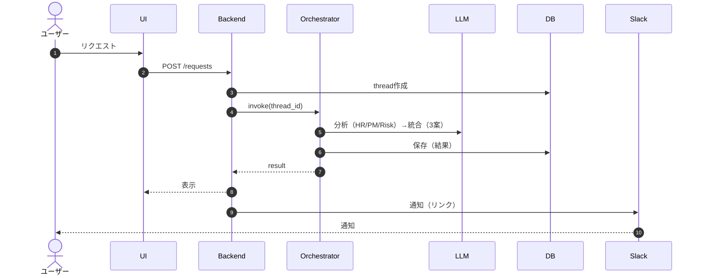
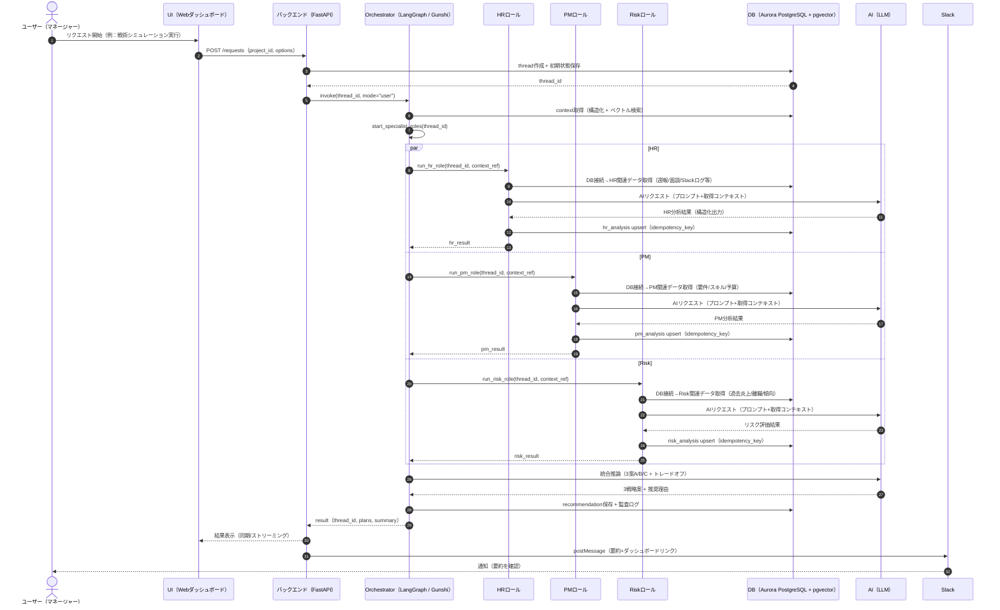
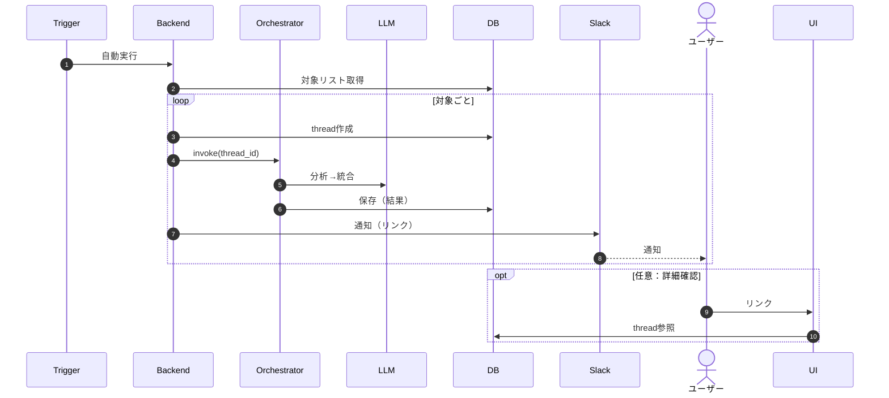
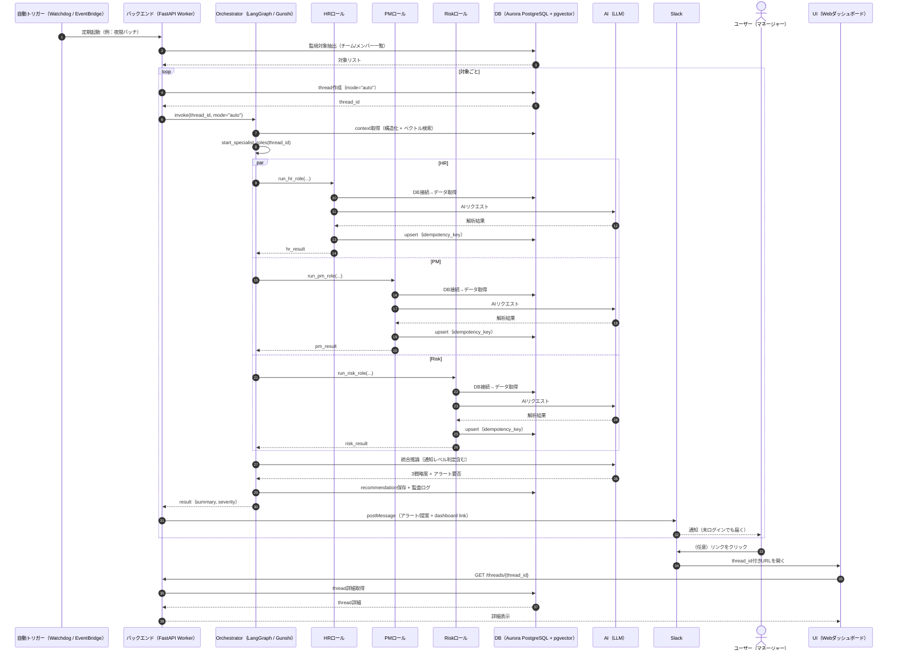
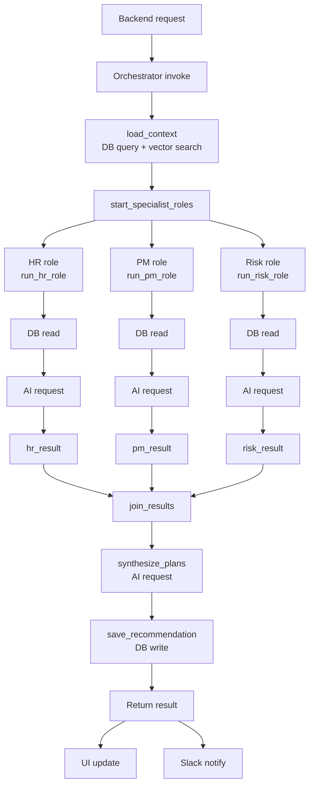
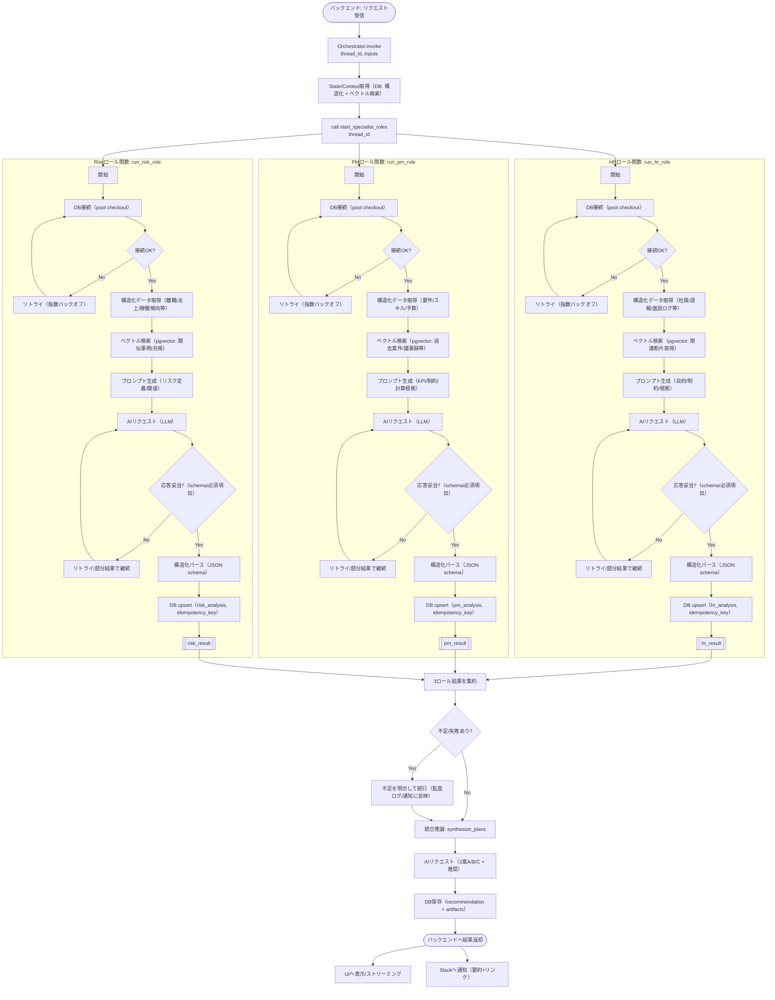

# Human-in-the-loop（HITL）機能要件・組み込み設計（SaihAI）

SaihAI における Human-in-the-loop（HITL / 時を止める介入機能）を、アプリに組み込むための要件・設計書です。
LangGraph の Checkpoint & Interrupt による停止/再開（Draft → Approval Pending → Execute）を核に、Slack 承認 UI、認可、監査ログまでを一貫して定義します。

> Phase 2 の技術検証項目を起点としつつ、本番組み込みで必要になる「責務分割・API・永続化・冪等性」まで含めます。

## 1. Goal（ゴール）

- AI が「勝手に」外部アクション（メール送信、申請、通知等）を実行しない
- 必ず人間（マネージャー）の明示的な承認を待ち、承認/指示に基づいて再開（Resume）できる
- 上記を「ログ/画面キャプチャ/監査ログ」で説明可能に証明できる

## 2. Scope（スコープ）

### 2.1 対象（IN）

- 承認待ちで停止できるワークフロー（LangGraph の interrupt）
- Slack 上の承認 UI（Approve / Reject / Request changes）
- 承認権限（認可）と不正操作防止（なりすまし/リプレイ/多重実行）
- 監査ログ（承認依頼→承認/却下→実行/失敗→介入履歴）

### 2.2 対象外（OUT / 今回は仕様のみ）

- 実アクションの外部 API（メール/カレンダー/稟議システム）連携の詳細（ここではインタフェース要件のみ）
- 複数段階承認（例: 二者承認）や SLA、運用監視体制の詳細（SHOULD として触れる）

### 2.3 前提アーキテクチャ（組み込み）

- Orchestrator: LangGraph（interrupt / resume、Checkpoint で state 永続化）
- API: FastAPI（Slack Interactions 受付、承認状態の更新、監査ログ記録、ダッシュボード提供）
- DB: Aurora PostgreSQL（thread/action/audit の永続化、冪等性キーの一意制約）
- Queue: SQS（Approve 後の Resume/実行ジョブを非同期処理）
- Slack: Block Kit（Approve / Reject / Request changes、メッセージ更新）

### 2.4 シーケンス図（ユーザー起動 / 自動起動）

> 補足: ここでは「分析→提案→通知」までを対象とします（外部API実行の詳細は OUT）。

#### 2.4.1 ユーザーがリクエスト開始（UI起動）

##### シンプル版



##### 複雑版



#### 2.4.2 自動起動モード（Watchdog Trigger）

##### シンプル版



##### 複雑版



### 2.5 フローチャート（Orchestrator→3ロール起動→DB/AI）

#### 2.5.1 シンプル版



#### 2.5.2 詳細版



## 3. 用語・登場人物

- **Approver（承認者）**: Slack 上で承認/却下/差し戻しを行うマネージャー
- **Requester（起案者）**: AI（SaihAI）
- **Action（外部アクション）**: メール送信、申請、予約登録など「副作用」を伴う実行
- **Thread / Workflow ID（thread_id）**: 1 つの起案→実行を一意に識別する ID（再開・監査ログの相関キー）
- **Approval Request ID（approval_request_id）**: 承認依頼を一意に識別する ID（Slack ボタンに埋め込み、再送/リトライの冪等性キー）
- **Slack Message（channel_id / message_ts）**: 承認メッセージの参照（更新・追跡用）
- **Idempotency Key（idempotency_key）**: 「同一 action_id は 1 回だけ」を保証するキー（例: thread_id + action_id）
- **Checkpoint**: 実行状態を永続化する仕組み（POC: MemorySaver / 本番: PostgreSQL（langgraph_checkpoints）等）
- **Interrupt（承認待ち）**: 実行直前で停止し、人間入力を待つ状態

## 4. 機能要件（MUST / SHOULD）

### 4.1 実行制御（HITL の本質）

- MUST: 副作用を伴う Node（例: executor）の直前で必ず停止できる（interrupt_before）
- MUST: 停止中でも状態（State）が消えずに保持される（プロセス再起動を跨いでも復元できる想定）
- MUST: 承認が得られるまで副作用アクションを実行しない（「ドラフト生成」は副作用ではない）
- MUST: 承認状態が `approved` のときのみ Resume できる
- MUST: 承認状態が `rejected/canceled/expired` のときは Resume しても実行しない（安全側で停止）
- MUST: 多重実行を防ぐ（Slack のリトライ/連打/二重通知でも「同一 action_id は 1 回だけ」）
- MUST: Slack Interactions の受信処理では副作用を実行せず、非同期ジョブ（Queue）に委譲する（Slack 応答制約と安全性）
- MUST: `thread_id` 単位の状態遷移はサーバ側で原子的に確定し、二重承認/二重実行を無害化する（冪等な更新）
- SHOULD: 期限（timeout/expiry）を設け、期限切れは `expired` として実行不可にする

### 4.2 Slack 承認 UI

- MUST: 承認依頼メッセージに以下を含める
  - 何を実行するか（アクション一覧）
  - 実行理由（要約）
  - 実行内容のプレビュー（例: メール本文ドラフト）
  - リスク/注意事項（例: 送信先、取り消し不可等）
  - Workflow ID（thread_id）または参照リンク（監査/追跡用）
- MUST: 操作は最低 3 種類を提供する（ボタンまたは同等）
  - Approve（承認して実行）
  - Reject（却下して終了）
  - Request changes（差し戻し/修正依頼）
- MUST: 各操作は `thread_id` と `approval_request_id` を payload に含める（メッセージ本文を解析しない）
- MUST: Request changes で入力されたフィードバックを State に反映し、再度承認待ちに戻す（承認は取り消される）
- SHOULD: 「詳細を見る（View details）」導線を提供する（Web ダッシュボード、または Slack モーダル）
- SHOULD: 承認/却下後、Slack メッセージ表示を更新し「結果（実行済/却下/期限切れ）」が分かる

### 4.3 権限・認可（Authorization）

- MUST: Slack インタラクションの実行者（Slack user_id）をサーバ側で検証する（UI のみで信頼しない）
- MUST: `thread_id` ごとに「承認可能なユーザー/ロール」を定義し、許可されたユーザーのみが承認操作できる
- MUST: 不正ユーザーが Approve/Reject/Request changes を実行した場合は拒否し、監査ログに記録する
- MUST: Slack 署名検証（リクエスト署名、タイムスタンプ）等により改ざん/リプレイを防止する
- MUST: Slack user_id を社内の主体（社員ID/ロール）にマッピングし、承認ポリシーで検証する
- SHOULD: 承認権限の決定ロジック（例: 担当マネージャー、プロジェクト責任者）を設定で差し替え可能にする
- SHOULD: 二者承認などの拡張余地を残す（現時点は単一承認でよい）

### 4.4 監査ログ（Audit Log）

- MUST: 以下のイベントを時系列で記録し、後から追跡可能にする（少なくとも 90 日相当を想定）
  - approval_requested（承認依頼を発行）
  - approval_approved / approval_rejected / approval_expired / approval_canceled
  - human_feedback_received（差し戻し/修正指示）
  - state_updated（State 更新、差分）
  - execution_started / execution_succeeded / execution_failed（副作用アクション）
  - unauthorized_action_attempted（不正操作）
- MUST: 監査ログは `thread_id` で検索できる（Slack の message_ts 等とも相関できる）
- MUST: 監査ログに個人情報/機密（PII・シークレット）を不用意に保存しない（必要な場合はマスキング/要約）
- MUST: 監査ログは `approval_request_id` / `action_id` などの相関キーを含める（追跡可能性の担保）
- SHOULD: 監査ログは追記専用（append-only）で改ざん検知可能（例: ハッシュチェーン）

### 4.5 状態遷移（State Machine）

| current_status | event | next_status | 備考 |
| --- | --- | --- | --- |
| drafted | approval_requested | approval_pending | 承認依頼を送信し、停止状態に入る |
| approval_pending | approve | approved | 認可 OK かつ期限内のみ |
| approval_pending | reject | rejected | 終了（実行しない） |
| approval_pending | cancel | canceled | 起案者（system）が取り下げ（実行しない） |
| approval_pending | request_changes | drafted | feedback を保存し、再ドラフトへ |
| approval_pending | expire | expired | 終了（実行しない） |
| approved | resume_requested | executing | 実行ジョブを開始（非同期） |
| executing | execution_succeeded | done | action_id の実行記録を確定 |
| executing | execution_failed | failed | リトライ方針に従う |

- MUST: `done/rejected/canceled/expired` は終端状態として不変（後から `approved` に戻さない）
- MUST: Resume は `approved` のみ許可し、それ以外は安全側で no-op + 監査ログに記録する

### 4.6 責務分割（コンポーネント境界）

- LangGraph（Worker）: 起案〜interrupt、承認済みの再開（executor 実行）、state の読み書き
- FastAPI: Slack 署名検証、認可、状態遷移の確定、監査ログ、Slack メッセージ更新、実行ジョブ enqueue
- DB: ステート・承認・実行記録・監査ログの永続化（冪等性制約の根拠）
- Queue: Slack 受信スレッドから切り離した Resume/実行の非同期処理

### 4.7 インタフェース（最小）

| 区分 | I/F | 目的 |
| --- | --- | --- |
| Slack → API | `POST /slack/interactions` | Approve/Reject/Request changes を受けて状態遷移を確定 |
| Worker → API/DB | `approval_requested`（内部呼び出し） | 承認依頼の作成（DB 更新 + Slack 送信 + 監査ログ） |
| API → Queue | `hitl.resume.requested` | 承認済み thread の再開ジョブを enqueue |
| Worker | `hitl.resume.requested` 消費 | `get_state` → `resume` → executor 実行 |

### 4.8 冪等性・多重実行対策（設計）

- Slack リトライ対策: `approval_request_id` + `decision` を冪等キーにし、同一キーは no-op（必要なら監査ログに重複として記録）
- 状態遷移の排他: `thread_id` 行ロック（または version による楽観ロック）で「承認→実行」競合を防ぐ
- action 実行の冪等性: `autonomous_actions(action_id)` をキーにし、executor は開始時に行ロック + `status` 更新で二重実行を防止

## 5. データ要件（例）

### 5.1 State（最低限）

- thread_id: string
- approval_request_id: string（最新の承認依頼 ID）
- status: `drafted | approval_pending | approved | rejected | canceled | expired | executing | done | failed`
- draft: string（プレビュー用）
- actions: array（実行予定アクションの一覧; 各要素に action_id を持つ）
- feedback: string（承認者からの差し戻し内容）
- requested_by: string（システム）
- approver_slack_user_id: string（承認者の想定）
- approved_by: string（実際に承認した Slack user_id）
- slack_channel_id: string（承認メッセージ送信先）
- slack_message_ts: string（承認メッセージの ts）
- expires_at: datetime（承認期限）
- timestamps: requested_at / approved_at / executed_at など

### 5.2 Audit Log（最低限）

- audit_id: string（UUID）
- thread_id: string
- event_type: string（上記イベント）
- actor_type: `system | human`
- actor_id: string（Slack user_id など）
- occurred_at: datetime
- summary: string（要約）
- correlation_id: string（approval_request_id / action_id 等）
- payload_ref: string（必要に応じて詳細への参照; PII を含めない）

### 5.3 永続化モデル（DBテーブル案）

- `langgraph_checkpoints`（PK: thread_id）
  - checkpoint（バイナリ形式のState）, metadata, updated_at
- `autonomous_actions`（PK: action_id）
  - action_type, draft_content, is_approved, approved_at, scheduled_at, status
  - proposal_id（`ai_strategy_proposals` に紐付け）

テーブル定義書: `requirement-docs/database-schema.md`

## 6. 受入条件（Acceptance Criteria / DoD）

- [ ] 承認前に副作用アクションが一切実行されない（ログ/監査ログで証明できる）
- [ ] 承認待ちで停止し、再開して実行できる（同一 thread_id で再現可能）
- [ ] Request changes により State が更新され、再度承認待ちになる
- [ ] 未承認/却下/期限切れの Resume で実行されない（安全側で停止）
- [ ] 不正ユーザーの承認操作が拒否され、監査ログに記録される
- [ ] 監査ログが `thread_id` で追跡でき、承認→実行まで一連の履歴が揃う
- [ ] Slack UI で承認結果が判別できる（メッセージ更新 or 追記通知）
- [ ] 多重実行（連打/Slack リトライ）でも実行は 1 回のみ

## 7. 検証シナリオ（推奨）

### 7.1 シナリオ A: 承認して実行（Happy Path）

1. AI が Draft を作成し、executor 前で停止（approval_pending）
2. Slack に承認依頼が届く
3. Approver が Approve
4. Resume され、executor が 1 回だけ実行される

期待結果:

- 承認前に executor のログが出ない
- 監査ログ: approval_requested → approval_approved → execution_started → execution_succeeded

### 7.2 シナリオ B: 差し戻し（修正指示）→ 再承認 → 実行

1. Approver が Request changes（例: 「もっと丁寧に」）
2. State が更新され、再度 approval_pending になる
3. AI がドラフトを更新し、再度承認依頼を出す（または同メッセージを更新）
4. Approver が Approve
5. 更新されたドラフトで実行される

期待結果:

- 監査ログに human_feedback_received / state_updated が残る
- 最終実行内容が更新後ドラフトと一致する

### 7.3 シナリオ C: 却下（Reject）

1. Approver が Reject
2. Resume しても実行されない

期待結果:

- 監査ログ: approval_rejected が残り、execution_* が発生しない

### 7.4 シナリオ D: 不正ユーザーの操作

1. 権限のないユーザーが Approve を押す

期待結果:

- 操作が拒否され、実行されない
- 監査ログ: unauthorized_action_attempted が残る

### 7.5 シナリオ E: 多重実行耐性

1. Approve を連打、または Slack リトライを発生させる

期待結果:

- executor は 1 回だけ実行される（idempotency）
- 監査ログ上も execution_started が重複しない（または重複は拒否として記録）

### 7.6 シナリオ F: 期限切れ（Expiry）

1. 承認依頼を発行し approval_pending のまま期限を過ぎる
2. status が expired になり、Resume しても実行されない

期待結果:

- 監査ログ: approval_expired が残り、execution_* が発生しない
- Slack メッセージが更新され「期限切れ」が判別できる

## 8. 技術検証用：ミニマム実装（参考）

目的: 「interrupt で止まる」「state が保持される」「人間介入で state を更新できる」ことを最小構成で確認する。
Slack UI/監査ログは実装が別になるため、ここではインタフェースの呼び出し点を示す。

```python
from __future__ import annotations

from typing import Literal, TypedDict

from langgraph.checkpoint.memory import MemorySaver
from langgraph.graph import StateGraph


class State(TypedDict, total=False):
    thread_id: str
    status: Literal[
        "drafted",
        "approval_pending",
        "approved",
        "rejected",
        "executing",
        "done",
    ]
    draft: str
    feedback: str


def drafting_node(state: State) -> State:
    return {
        "status": "drafted",
        "draft": "（メール下書きプレビュー）...",
    }


def request_approval_node(state: State) -> State:
    # Slack: 承認依頼を送る（Approve/Reject/Request changes）
    # Audit: approval_requested を記録する
    return {
        "status": "approval_pending",
    }


def executor_node(state: State) -> None:
    # 副作用アクション（ここでは print で代用）
    print(f"EXECUTE: {state['draft']}")


builder = StateGraph(State)
builder.add_node("drafter", drafting_node)
builder.add_node("approval", request_approval_node)
builder.add_node("executor", executor_node)

builder.set_entry_point("drafter")
builder.add_edge("drafter", "approval")
builder.add_edge("approval", "executor")

memory = MemorySaver()

# executor の直前で必ず止める（HITL）
graph = builder.compile(checkpointer=memory, interrupt_before=["executor"])
```

## 9. Evidence（審査員/関係者への提示物）

- 承認待ちで停止している証拠
  - `get_state` で draft と次ノード（executor）が確認できるログ
- 人間の介入が反映された証拠
  - Slack の Request changes 入力、または state 更新ログ（state_updated）
- 承認後に実行された証拠
  - executor 実行ログ + 監査ログ（execution_started / execution_succeeded）

---

## Appendix: 原文（研修メモ）

<details>
<summary>原文を表示</summary>

Human-in-the-loop研修: Phase 2 技術検証項目2 詳細

Phase 2の技術検証項目2**「Human-in-the-loop（時を止める介入機能）」**の詳細な進め方、具体的な実装ステップ、および検証シナリオを提案します。

-----🎯 検証のゴール

**「AIが勝手にアクション（メール送信等）を実行せず、必ず人間（マネージャー）の承認を待機し、指示を受けてから再開できること」**をコードレベルで証明すること。

-----🛠️ 検証手順：LangGraph "Checkpoint & Interrupt" の実装

複雑な4体のエージェントを全て動かす必要はありません。**「起案（Draft）」→「承認待ち（Interrupt）」→「実行（Execute）」**という最小単位のワークフローで検証を行います。
ステップ
内容
検証ポイント
Step 1
状態（State）の定義
プロセスが止まっても、変数が消えずに残っているか。会話履歴や承認ステータスを保持するための「状態」を定義。
Step 2
グラフの構築と「割り込み」の設定
LangGraphの compile メソッドにある interrupt_before パラメータが核心。

- 構成

1. Draft Node: メール文面作成。 2. Execute Node: メール送信（printで代用）。

- 割り込み設定
interrupt_before=["Execute Node"] を設定し、実行直前で停止。

- メモリ設定
MemorySaver を使用し、スレッドIDに基づいて状態を永続化。
Step 3
実行と「一時停止」の確認
Draft Nodeが動いた後、Execute Nodeの手前でプロセスが終了（停止）することを確認。

- 検証コマンド
graph.get_state(thread_id) を実行し、現在のステート（メールの下書き文面）が保存されていることを確認。
Step 4
人間の介入（State Update）と再開（Resume）
「SaihAI」独自のユーザー体験（チャットで修正指示）の技術的裏付け。

- シナリオA（承認）
何も変更せず、Noneを入力して続行 → 「メール送信しました」と出力されるか。

- シナリオB（修正指示）
ユーザーが修正指示を出したと仮定し、ステート内のメール文面を書き換えてから再開 → 書き換わった文面で送信されるか。

-----💻 技術検証用：ミニマム実装コード（Python）
from typing import TypedDict
from langgraph.graph import StateGraph, END
from langgraph.checkpoint.memory import MemorySaver

# 1. 状態の定義

class State(TypedDict):
    draft: str  # メール下書き
    feedback: str  # 人間からの修正指示

# 2. ノード（処理）の定義

def drafting_node(state: State):
    print("--- 🤖 AI: メールを下書きしました ---")
    # 実際のLLM呼び出しを想定
    return {"draft": "田中様、プロジェクトの件ですが..."}

def execution_node(state: State):
    print(f"--- 🚀 AI: メールを送信しました！内容: 「{state['draft']}」 ---")
    return

# 3. グラフの構築

builder = StateGraph(State)
builder.add_node("drafter", drafting_node)
builder.add_node("executor", execution_node)

builder.set_entry_point("drafter")
builder.add_edge("drafter", "executor")

# ★ここが重要：メモリ（永続化層）のセットアップ

memory = MemorySaver()

# ★ここが重要：「executor」の前に必ず止まるように設定

graph = builder.compile(checkpointer=memory, interrupt_before=["executor"])

# --- 検証シナリオ実行 ---

# シナリオ設定: 特定のスレッドID（会話ID）で実行

thread_config = {"configurable": {"thread_id": "thread-1"}}

print("\n=== STEP 1: 初回実行（ドラフト作成まで） ===")

# 入力なしでスタート

graph.invoke({"feedback": ""}, config=thread_config)

# ここでプログラムは自動的に停止しているはず

snapshot = graph.get_state(thread_config)
print(f"⏸️ 現在の状態（一時停止中）: {snapshot.values['draft']}")
print(f"Next Step: {snapshot.next}") # 次に実行されるのが 'executor' であることを確認

print("\n=== STEP 2: 人間の介入（修正指示）と再開 ===")

# ユーザーが「もっと丁寧に」と修正指示を出したと仮定し、ステートを書き換える（update_state）

new_draft = "田中様、いつも大変お世話になっております。プロジェクトの件ですが..."
graph.update_state(thread_config, {"draft": new_draft})
print(f"✍️ 人間が修正介入しました: {new_draft}")

# 再開（Resume）。Noneを渡すことで、止まっていたところから再開する

print("🔄 プロセス再開...")
graph.invoke(None, config=thread_config)
-----📊 審査員への見せ方（Evidence Output）

上記のコードを実行し、以下の3点のログまたは画面キャプチャを資料に貼り付けてください。
「⏸️ 現在の状態（一時停止中）」のログ
AIが下書きを作成した段階でプロセスが停止し、ステート（変数）が保持されている証拠。
「✍️ 人間が修正介入しました」のログ
Pythonスクリプト上で、変数の値を外部から書き換えた証拠。これが**「Slackで『もっと丁寧に書いて』と送ったら反映された」**という体験の技術的証明になります。
「🚀 メールを送信しました！」のログ
書き換えられた内容で最終アクションが実行された証拠。
この検証により、企画書にある**「LangGraph "Human-in-the-loop"」**が実装可能なアーキテクチャであることを強力に証明できます。

</details>
