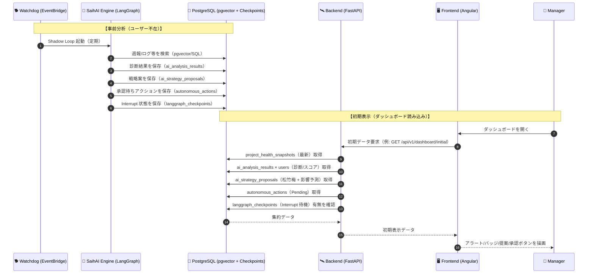
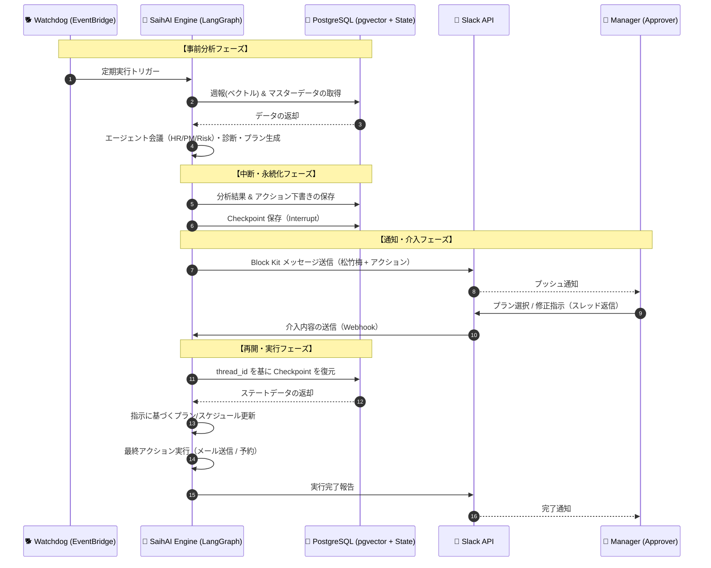

# 初期表示・事前分析（シャドーモニタリング）設計

本書は、**事前分析（Watchdog による自律解析）** が完了し、DB（PostgreSQL）へ結果が格納されていることを前提に、**ダッシュボード初期表示** と **Slack 通知/HITL（介入）** の繋がりを整理する。

## 0. 前提（ゴール）

- ユーザー（マネージャー）がログインした瞬間に、**「いまの危機」** と **「AI が準備した解決策」** が同期されて表示される。
- AI の外部アクション（メール送信/予約など）は、必ず **承認待ち（Interrupt）** で停止し、HITL を経て実行される。

## 1. 初期表示シーケンス（ダッシュボード読み込み）

### 1.1 シーケンス図



### 1.2 シーケンスの解説

1. **バックグラウンド処理（Watchdog）**
   - ユーザーがログインする前に、Watchdog が定期的に Shadow Loop を起動する。
   - HR/PM/Risk が週報やログを解析し、リスクスコアと根拠（議論ログ）を `ai_analysis_results` に保存する。
   - 軍師（Gunshi）が「松竹梅」戦略案を合成して `ai_strategy_proposals` に保存する。
   - 根回しメール等の「承認待ちアクション」を `autonomous_actions` に作成し、LangGraph を **Interrupt** して `langgraph_checkpoints` に状態を永続化する。
2. **ダッシュボードアクセス（初期表示）**
   - マネージャーがダッシュボードを開くと、フロントエンドは初期表示に必要なデータを一括取得する（または BFF で集約する）。
3. **データ集約（Backend）**
   - `project_health_snapshots` からプロジェクト健全性（health_score / risk_level / variance_score 等）を取得する。
   - `ai_analysis_results × users` から診断パターン（燃え尽き等）と根拠ログ（debate_log）を取得する。
   - `autonomous_actions` から AI が下書きを終えている「承認待ちタスク」を取得する。
   - `langgraph_checkpoints` から Interrupt により待機しているスレッドの有無をチェックする。
4. **レンダリング（Frontend）**
   - 取得したデータを基に、炎上アラート/リスクバッジ/「AIからの緊急提案」/承認ボタンを反映する。

## 2. 初期表示のためのデータ処理の要諦

- **「生きた」診断結果の表示**: 初期表示時点で、HR が検知した「燃え尽き（Burnout）」兆候が、適合度（Score）と共にメンバー一覧に強調表示される。
- **戦略プランの先行ロード**: 軍師が生成した「松竹梅」の 3 案が、エージェント同士の議論要約（Debate Summary/Log）と共にロードされる。
- **アクションの即時承認待ち**: 「ケア面談の設定（仮押さえ）」等が、Slack 通知と同期し、ダッシュボード上でも承認ボタンとして待機する。

## 3. 初期表示時にフェッチするデータ群

### 3.1 バックエンドが一括取得する想定データ

- **プロジェクトの「今」**: `project_health_snapshots`（health_score / risk_level / variance_score / manager_gap_score）
- **メンバーの「状態」**: `ai_analysis_results × users`（診断パターン + debate_log）
- **AI が準備した「策」**: `ai_strategy_proposals`（松竹梅 3 プラン + predicted_future_impact）
- **今すぐ承認すべきアクション**: `autonomous_actions`（Pending の根回しタスク）
- **停止中の LangGraph**: `langgraph_checkpoints`（Interrupt 待機スレッドの存在確認）

### 3.2 UI/UX への反映（初期画面の 4 大セクション）

| UIコンポーネント | 表示内容 | データの紐付け |
| --- | --- | --- |
| ① プロジェクト・アラート | 「炎上中」バッジ、health_score / risk_level の可視化 | `project_health_snapshots`（最新） |
| ② メンバー Genome リスト | 「燃え尽き」「ダイヤの原石」等の診断バッジ。クリックで根拠ログ確認 | `ai_analysis_results`（pattern / debate_log） + `users` |
| ③ 軍師の緊急提案（Modal） | 「松竹梅」3案を並列提示。推奨案にはバッジ | `ai_strategy_proposals` |
| ④ Action Required（HITL） | 「面談（仮押さえ済み）」「メール（下書き済み）」の承認ボタン | `autonomous_actions`（status=Pending） |

## 4. 初期表示用 API レスポンス（JSON イメージ）

フロントエンド（Angular）が受け取るデータ構造の例。

```json
{
  "kpis": [
    { "label": "エンゲージメント", "value": 78, "suffix": "%", "delta": "▲ 2.4pt", "color": "#10b981", "deltaColor": "#10b981" }
  ],
  "alerts": [
    {
      "id": "alert-P001-202501",
      "title": "プロジェクト・フェニックス のリスクが上昇",
      "subtitle": "Health 72 / variance 0.42",
      "risk": 72,
      "severity": "medium",
      "status": "open",
      "projectId": "P001"
    }
  ],
  "members": [
    {
      "id": "U002",
      "name": "田中 未来",
      "role": "Dev",
      "skillLevel": 10,
      "cost": 95,
      "availability": 60,
      "skills": ["Dev", "L10", "Java"],
      "notes": "腰痛が悪化しており、レガシー案件に飽きている。",
      "analysis": {
        "patternId": "burnout",
        "patternName": "燃え尽き",
        "finalDecision": "不採用"
      }
    }
  ],
  "proposals": [
    {
      "id": 12,
      "projectId": "P001",
      "planType": "Plan_B",
      "description": "佐藤をリーダーに抜擢し、田中を週2日の技術顧問にスライドさせる",
      "recommendationScore": 82,
      "isRecommended": true
    }
  ],
  "pendingActions": [
    { "id": 101, "proposalId": 12, "actionType": "mail_draft", "title": "体制変更の連絡", "status": "approval_pending" }
  ],
  "watchdog": [
    { "t": "09:00", "text": "全社解析完了（12名の週報を更新）", "dot": "#6366f1" }
  ],
  "checkpointWaiting": true
}
```

## 5. 事前分析処理（シャドーモニタリング / Shadow Loop）

この解析は、EventBridge 等のタイマーをトリガーに、ユーザーが操作していない間も自律的に実行される。

### 5.1 実行ステップ

1. **情報収集（Multi-Source Retrieval）**
   - HR: `weekly_reports` を pgvector でセマンティック検索し、離職予兆/成長意欲をスコア化する。
   - PM: `users`/`projects` からスキル合致度、単価、稼働率等を定量的に取得する。
   - Risk: 過去データを基に、炎上/離職等の損害リスクを推定する。
2. **エージェント会議（Debate Logic）**
   - LangGraph 上で HR/PM/Risk の議論を強制し、根拠を `debate_log`（JSON）として蓄積する。
3. **診断確定（Diagnostic Classification）**
   - 軍師が議論を統合し、6 つの診断パターン（燃え尽き/ダイヤの原石/隠れ爆弾等）に分類して `ai_analysis_results` に保存する。
4. **戦略合成（松竹梅プラン生成）**
   - 診断済みメンバーを組み合わせ、3 つのシナリオを `ai_strategy_proposals` に生成する。
5. **介入ポイント生成（Interrupt & Wait）**
   - 各プランに付随する下書き（メール/面談予約等）を `autonomous_actions` に保存する。
   - LangGraph を Interrupt し、状態を `langgraph_checkpoints` に永続化して待機する。

## 6. シャドーモニタリング通知（Slack）と HITL（介入）

### 6.1 受動的介入フロー（Push → Approve/Intervene）

1. **通知のトリガー**
   - 事前分析で緊急度の高いリスクが検知されると、Slack に通知する（Block Kit）。
2. **意思決定（2 パターン）**
   - **即時承認（Approve）**: ボタン押下で Interrupt 状態を解除し、実アクションを実行する。
   - **自然言語介入（Intervention）**: スレッド返信で制約（例: 送信日）を渡し、ステートを書き換えて再開（Resume）する。

### 6.2 シーケンス図（Shadow Monitoring / HITL）



### 6.3 実装のポイント（ステート管理）

- **Interrupt の徹底**: 外部アクション直前で必ず停止し、`langgraph_checkpoints` に保存する。
- **スレッド ID の活用**: Slack の `thread_ts` を `thread_id` として DB と紐付け、後追い介入でも文脈を復元できるようにする。

### 6.4 Slack UI 設計（Block Kit）

マネージャーに送るメッセージは、情報の優先順位に基づき以下のセクションで構成する。

- **Header**: 誰の、どんなリスクか（例: 「田中さんの離職リスク 85%」）を明示
- **Plans（松竹梅）**: 3 つのプランをカードとして並べ、各プランに選択ボタンを配置（推奨プランは明示）
- **Actions**: 「詳細をダッシュボードで見る」「全体への修正指示（介入）」などの導線を配置

各ボタンに `proposal_id`（または `plan_id`）と `thread_id` を `value` として埋め込み、DB の状態（`langgraph_checkpoints`）と 1:1 に同期させる。

```json
{
  "type": "actions",
  "elements": [
    { "type": "button", "text": { "type": "plain_text", "text": "🌲 プランAを選択" }, "action_id": "select_plan_a", "value": "thread_id:xxx|plan:A" },
    { "type": "button", "text": { "type": "plain_text", "text": "🎋 プランBを選択" }, "action_id": "select_plan_b", "value": "thread_id:xxx|plan:B" },
    { "type": "button", "text": { "type": "plain_text", "text": "🌸 プランCを選択" }, "action_id": "select_plan_c", "value": "thread_id:xxx|plan:C" }
  ]
}
```

### 6.5 インタラクション実装（Plan 選択 / 自然言語介入）

- **Plan 選択（ボタン）**
  - Slack Interactive で `action_id`/`value` を受信する。
  - `thread_id` をキーに Checkpoint をロードし、「選択されたプラン」をステートへ反映する。
  - 選択プランに紐づく「準備済みアクション」をスレッドへプレビュー投稿し、最終確認（Execute）を出す。
- **介入（スレッド返信テキスト）**
  - `message.channels` 等を購読し、スレッド返信をトリガーにする。
  - 返信テキストを「制約/修正指示」としてステートへ注入（`graph.update_state` 相当）し、`Resume` で再開する。

実装の受け口（例）:

- `POST /slack/events`: Interactive（ボタン）と Events（メッセージ返信）の両方を受け付ける
- 推奨: `slack-bolt` + `FastAPI`（adapter）で実装する

ハマりどころ:

- **`ack()` の忘れ**: Slack への応答は 3 秒以内が必須（タイムアウトすると再送される）
- **`thread_ts` の管理**: Slack の `ts` がスレッド ID になるため、DB の `thread_id` と確実に同期する

> 冪等性/認可/監査ログなど「本番組み込みの追加要件」は `requirement-docs/human-in-the-loop.md` を参照。

## 7. 開発チーム向けメモ（UX）

初期表示の実装では、**「AI が分析中」** なのか **「分析済み結果がある」** のかのステータス管理が重要。
未完了項目がある場合は、スケルトンスクリーンを出しつつ非同期で解析を走らせ、完了次第 UI を更新する（滑らかな UX）。
