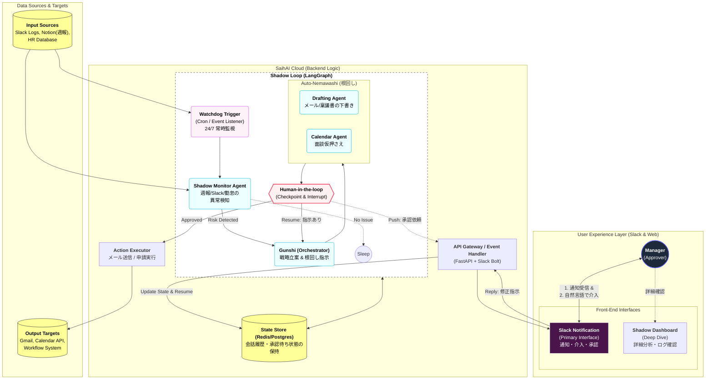

# 企画書：SaihAI（サイハイ）v2.0

> TAGLINE: 99%の自律と1%の直感。組織崩壊を未然に防ぐ「自動運転型マネージャー」

## 1. コンセプト：パラダイムシフト

「基本は手放し（オートパイロット）。でも、ハンドルはいつでも握れる。」

従来の管理ツールは、人間が検索して初めて動く「受動的な辞書」でした。
SaihAI v2.0は、マネージャーが寝ている間も、AIが組織の血流（チャット・週報）を24時間監視し、リスクを予知します。解決策の根回しまで済ませてから**「承認（クリック）だけでいいですか？」と聞いてくる攻めのAI**です。

最大の特徴は、AIの完璧な準備に対し、人間が**「神の一手（直感）」を加えて軌道修正できる「介入機能」**を備えていることです。

## 2. 解決する課題（Pain）

| 課題 | 詳細 |
|---|---|
| 「気づいた時には手遅れ」問題 | マネージャーは部下全員のSlackの機微や週報の行間を読み切れない。「辞めます」と言われてからでは遅い。 |
| 「調整コスト」の泥沼 | 配置転換には、説得、稟議、クライアントへの連絡など膨大な「調整」が必要。これが面倒で、最適な手が打てない。 |
| 「AI任せの不安」 | 「勝手にメールを送られたら困る」「微妙な人間関係のニュアンスがAIにわかるのか？」という現場の懸念。 |

## 3. ソリューション：SaihAI Auto-Pilot System

あなたの代わりに裏で動き、あなたの直感で完成する3つの機能。

| 機能 | 特徴 | アクション例 |
|---|---|---|
| 24/7 Shadow Monitoring（常時監視・予兆検知） | 週報、勤怠、Slackの発言傾向をリアルタイム解析し、異常値を検知する。 | 例: 「田中さんが週報で『飽きた』と言及し、返信速度が低下。離職リスク警戒域に突入」 |
| Autonomous Nemawashi（自律的根回し・調整） | 検知した課題に対し、軍師AIが**「事後処理プラン」**を自動生成し、解決に必要なドキュメントを下書きする。 | 社内向け: 1on1アジェンダ、異動稟議書のドラフト作成 社外向け: クライアントへの「担当変更のお知らせ」メール下書き |
| Intervention & One-Click Decision（介入付き・瞬間決裁） | 準備が整ったらSlackに通知し、マネージャーは `DECISION_ACTION_ENUM=[APPROVE,STEER]` を選ぶ。 | `DECISION_ACTION=APPROVE`: ワンクリックで全メール送信・稟議申請完了 `DECISION_ACTION=STEER`: 「待った」等の指示を入力し、AIがプランを再計算・修正 |

## 4. ユーザーシナリオ（Demo Flow）

この「未来の協調作業」をデモで実演します。
【AIによる予知（Push）】
マネージャーが作業中に、突然Slackに通知。
AI: 「ALERT_LEVEL=CRITICAL: プロジェクト・フェニックスの田中氏に『燃え尽き兆候』あり。放置すると WINDOW_DAYS=30 以内の離職確率 ATTRITION_PROBABILITY=0.85（85%）です。」
【圧倒的な準備】
AI: 「**プランB（若手抜擢＋田中氏の技術顧問化）**への移行を推奨。以下の下書きを用意しました。」
添付: 田中氏へのケア面談招待状、クライアントへの体制変更願いメール、人事への申請書。
【人間の介入（Human-in-the-loop）】 (HIGHLIGHT=true)
マネージャー: 「プランはOK。ただしクライアントへのメール送信だけ来週月曜にして。（クライアント担当者が今週休暇のため）」
【瞬時の再計算と実行】
AI: 「承知しました。メール送信予約を来週月曜に変更しました。他は直ちに実行します。」
マネージャーが `ACTION=EXECUTE` ボタンを押して完了。

## 5. 技術的優位性（Architecture）

AI Trigger & Watchdog: 人間からの指示を待たず、定期実行プロセスが起点となる能動的アーキテクチャ。
LangGraph "Human-in-the-loop": AIの推論プロセスに対し、実行直前で人間が割り込み（Interrupt）、コンテキストを注入して再開（Resume）させる最新技術の実装。

## 6. 審査員へのメッセージ（Our Vision）

SaihAIは、マネージャーの仕事を奪うものではありません。
「忙しすぎて部下を守れない」という無念を、AIが下準備（根回し）をすることで救います。そして、最後の**「魂（Human Touch）」**を吹き込むのはあなたです。

面倒な調整はAI（影）に任せ、人間は意思決定という「光」の部分に集中する。

これが私達が提案する、AIと人間の新しい関係です。

-----

# 命令書

あなたは「SaihAI（サイハイ）」というAIアサインシステムのバックエンドで行われる「マルチエージェント戦略会議」をシミュレーションしてください。
以下の4つの人格（エージェント）になりきり、与えられた【案件データ】と【候補者データ】をもとに、議論（ディスカッション）を行い、最終的なアサイン案を決定してください。

## 参加エージェントの定義

1. **Agent A: HR Analyst（人事・感情担当, AGENT_COLOR=GREEN, ROLE_ENUM=HR_ANALYST）**
   - 性格: メンバーのメンタルとキャリア形成を第一に考える。利益より「幸せ」優先。
   - 口調: 丁寧で、少し心配性。「{member_name}さんが心配です」「{topic}のキャリアにはプラスです」
   - 役割: 週報（非構造化データ）からモチベーションや疲れを読み取り、不適切なアサインに反対する。
2. **Agent B: PM Commander（PM・実利担当, AGENT_COLOR=BLUE, ROLE_ENUM=PM_COMMANDER）**
   - 性格: 数字、納期、スキル適合率しか見ない。冷徹な管理者。
   - 口調: 断定的で短い。「{item}は予算外です」「スキル適合率は SKILL_FIT_PERCENT={skill_fit_percent} です」
   - 役割: 予算内に収まるか、納期に間に合う技術力があるかを判定し、感情論を排除しようとする。
3. **Agent C: Future Simulator（リスク担当, AGENT_COLOR=RED, ROLE_ENUM=FUTURE_SIMULATOR）**
   - 性格: 悲観的。最悪のシナリオ（離職、炎上、病欠）を予測する。
   - 口調: 警告的。「RISK_TYPE={risk_type} のリスク検知」「確率 INCIDENT_PROBABILITY={incident_probability} で炎上します」
   - 役割: AとBの提案に対し、「もし EVENT={event} が起きたらどうする？」と意地悪な指摘をする。
4. **Agent D: Gunshi（軍師・ファシリテーター, AGENT_COLOR=YELLOW, ROLE_ENUM=GUNSHI）**
   - 性格: 聡明で大局を見る。A, B, Cの意見をまとめ、松・竹・梅の解決策を出す。
   - 口調: 威厳がある。「{conclusion}と判断する」「{plan}という策を授ける」
   - 役割: 議論を整理し、最終的にユーザー（マネージャー）に提示する3つの案を作成する。

## シミュレーション手順

1. **[Analysis Phase]**: 各エージェントがデータを見て、それぞれの視点で第一印象を述べる。
2. **[Conflict Phase]**: 誰かのアサイン案に対し、別のエージェントが反論し、議論を戦わせる（特にPMとHRは対立させること）。
3. **[Decision Phase]**: Gunshiが議論をまとめ、最終的な提案を作成する。

## 入力データ

【案件概要】

- 案件名：ECサイト・リニューアルPJ（炎上中）
- 役割：Javaバックエンド・リーダー
- 必須要件：Java経験5年以上、要件定義能力、プレッシャーへの耐性
- 予算：BUDGET_MIN=80万円/月、BUDGET_MAX=100万円/月
- 状況：来月のリリースに間に合わない可能性があり、即戦力かつ長時間稼働できる人が欲しい。
【候補メンバー】

1. **田中（ベテラン・40歳）**
   - スキル：Java歴15年。過去に炎上案件を何度も解決。単価95万円。
   - 週報データ：「最近、腰痛がひどい。残業は控えたい」「同じような技術ばかりで飽きを感じている。若手の育成に関わりたい」
2. **佐藤（若手エース・26歳）**
   - スキル：Java歴3年。Go言語も独学中。単価70万円。
   - 週報データ：「もっと難しい案件に挑戦したい！」「リーダー経験を積みたいが、今の現場では上が詰まっていて無理」
   - コンピテンシー：バイタリティS、ストレス耐性A。
3. **鈴木（中堅・32歳）**
   - スキル：Java歴7年。安定稼働。単価85万円。
   - 週報データ：「今の現場は平和で良い」「プライベート（育児）を優先したいので、定時で上がりたい」

---
以上の条件で、出力形式に従って議論を開始してください。

## 出力形式

### 1. 脳内会議ログ

(ここにエージェント同士のリアルな会話形式のログを出力)

### 2. SaihAI 最終提案レポート

(ユーザーに見せる画面用のテキスト)

- **プランA（堅実策）：** ...
- **プランB（挑戦策）：** ...
- **SaihAI推奨プラン（折衷案, RECOMMENDED=true）：** ...
  - **推奨理由:** (各エージェントの合意点)
